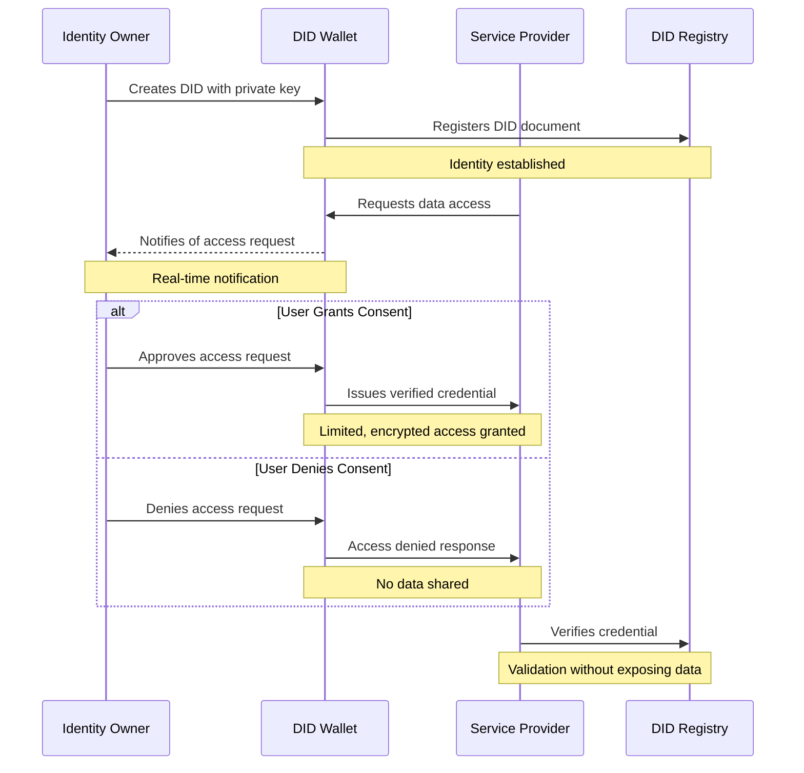

# Digital Identity Protection with VBI

In today's digital landscape, protecting our identity has become more crucial than ever. Traditional identity systems often leave users with little control over their personal data, creating vulnerabilities and privacy concerns. This implementation guide introduces a robust Decentralized Identifier (DID) system that puts users back in control of their digital identity for both organizations and its employees alike.

## Why Self-Sovereign Identity Matters

Self-sovereign identity represents a paradigm shift in how we manage digital identities. Instead of relying on centralized authorities to store and control our personal information, users maintain their own private keys and have complete visibility over who accesses their data. This approach offers several key benefits:

1. **Data Ownership**: Users retain full control over 1their personal information
2. **Transparency**: Every data access attempt is logged and requires explicit consent
3. **Security**: Private key infrastructure ensures only authorized access
4. **Privacy**: Users can selectively disclose only necessary information
5. **Consent Management**: Real-time notifications and granular permission controls

## System Architecture and Data Flow



## Key Security Features

This implementation ensures robust identity protection through:

- **Private Key Management**: Secure storage and management of private keys
- **Consent Notifications**: Real-time alerts for data access requests
- **Audit Trail**: Complete history of data access and consent decisions
- **Granular Permissions**: Fine-grained control over data sharing
- **Revocation**: Ability to revoke access at any time

## Implementation Benefits

Organizations implementing this system can:

1. **Enhance Trust**: Build user confidence through transparent data handling
2. **Reduce Risk**: Minimize liability by giving users control over their data
3. **Improve Compliance**: Meet regulatory requirements for data protection
4. **Streamline Operations**: Automate identity verification and consent management
5. **Future-Proof**: Adopt emerging standards in digital identity

By implementing this DID-based identity system, we create a more secure, transparent, and user-centric approach to digital identity management. Users gain unprecedented control over their personal information, while organizations benefit from improved security and simplified compliance.

# Detailed DID Implementation Setup Guide for Digital Ocean & Azure Entra

## 1. Setting Up Azure B2C Custom Policies for DID Verification

## Prerequisites

- Azure subscription with B2C tenant
- Global administrator access to your Azure AD B2C tenant
- Azure CLI installed on your machine

## Step-by-Step Setup Guide

### 1. Initial Azure Setup

```bash
# Install Azure CLI
curl -sL https://aka.ms/InstallAzureCLIDeb | sudo bash

# Login to Azure
az login

# Set your B2C tenant
az account set --subscription "your-subscription-name"
```

### 2. Create Required Policy Files

Create a new directory for your policies:

```bash
mkdir b2c-policies
cd b2c-policies
```

Create the following files:

1. `TrustFrameworkBase.xml`
2. `TrustFrameworkExtensions.xml`
3. `SignUpOrSignIn.xml`
4. `PasswordReset.xml`
5. `ProfileEdit.xml`

### 3. Configure Base Policy File

Save this as `TrustFrameworkBase.xml`:

```xml
<?xml version="1.0" encoding="UTF-8" standalone="yes"?>
<TrustFrameworkPolicy xmlns="http://schemas.microsoft.com/online/cpim/schemas/2013/06"
  PolicySchemaVersion="0.3.0.0"
  TenantId="yourtenant.onmicrosoft.com"
  PolicyId="B2C_1A_TrustFrameworkBase"
  PublicPolicyUri="http://yourtenant.onmicrosoft.com/B2C_1A_TrustFrameworkBase">

  <BuildingBlocks>
    <!-- Add basic claims schema -->
    <ClaimsSchema>
      <ClaimType Id="didIdentifier">
        <DisplayName>DID Identifier</DisplayName>
        <DataType>string</DataType>
      </ClaimType>
    </ClaimsSchema>
  </BuildingBlocks>

  <!-- Add base technical profiles -->
</TrustFrameworkPolicy>
```

### 4. Deploy Policies to Azure B2C

```bash
# Set variables
B2C_TENANT="yourtenant.onmicrosoft.com"
POLICY_PATH="./b2c-policies"

# Upload policies in correct order
az policy upload \
  --tenant-name $B2C_TENANT \
  --policy-path "$POLICY_PATH/TrustFrameworkBase.xml"

az policy upload \
  --tenant-name $B2C_TENANT \
  --policy-path "$POLICY_PATH/TrustFrameworkExtensions.xml"

az policy upload \
  --tenant-name $B2C_TENANT \
  --policy-path "$POLICY_PATH/SignUpOrSignIn.xml"
```

### 5. Configure DID Journey

Create `did-journey.xml`:

```xml
<?xml version="1.0" encoding="UTF-8" standalone="yes"?>
<TrustFrameworkPolicy xmlns="http://schemas.microsoft.com/online/cpim/schemas/2013/06"
  PolicySchemaVersion="0.3.0.0"
  TenantId="yourtenant.onmicrosoft.com"
  PolicyId="B2C_1A_DID_SIGNUP_SIGNIN"
  PublicPolicyUri="http://yourtenant.onmicrosoft.com/B2C_1A_DID_SIGNUP_SIGNIN">

  <BasePolicy>
    <TenantId>yourtenant.onmicrosoft.com</TenantId>
    <PolicyId>B2C_1A_TrustFrameworkExtensions</PolicyId>
  </BasePolicy>

  <UserJourneys>
    <UserJourney Id="SignUpOrSignInWithDID">
      <OrchestrationSteps>
        <!-- Step 1: Check DID -->
        <OrchestrationStep Order="1" Type="ClaimsExchange">
          <ClaimsExchanges>
            <ClaimsExchange Id="DIDVerification" TechnicalProfileReferenceId="DID-Validation" />
          </ClaimsExchanges>
        </OrchestrationStep>

        <!-- Step 2: Sign up or sign in -->
        <OrchestrationStep Order="2" Type="ClaimsExchange">
          <ClaimsExchanges>
            <ClaimsExchange Id="SignUpOrSignIn" TechnicalProfileReferenceId="LocalAccountSignUpWithLogonEmail" />
          </ClaimsExchanges>
        </OrchestrationStep>

        <!-- Step 3: Issue token -->
        <OrchestrationStep Order="3" Type="SendClaims" CpimIssuerTechnicalProfileReferenceId="JwtIssuer" />
      </OrchestrationSteps>
    </UserJourney>
  </UserJourneys>
</TrustFrameworkPolicy>
```

### 6. Configure in Azure Portal

1. Go to Azure Portal
2. Navigate to your B2C tenant
3. Select "Identity Experience Framework"
4. Click "Policy Keys"
5. Add necessary keys:
   - Token signing key
   - Token encryption key
   - Identity provider keys (if using external providers)

### 7. Test the Policy

1. In Azure Portal, go to your B2C tenant
2. Select "Identity Experience Framework"
3. Click on your new policy (B2C_1A_DID_SIGNUP_SIGNIN)
4. Click "Run now"

### 8. Verify Configuration

Check these elements:

- Policy uploads successfully
- Technical profiles are correctly configured
- DID validation endpoint is accessible
- Claims mapping is correct
- User journey flows as expected

### Common Issues and Solutions

1. **Policy Upload Fails**

```bash
# Validate policy XML
az policy validate \
  --tenant-name $B2C_TENANT \
  --policy-path "$POLICY_PATH/your-policy.xml"
```

2. **DID Validation Fails**

- Check endpoint URL in technical profile
- Verify service is running
- Check network access

3. **Claims Issues**

- Verify claims schema matches your application
- Check input/output claims mapping

Need additional assistance with:

- Detailed orchestration steps?
- Additional technical profiles?
- Error handling configurations?
- Application registration steps?

Just let me know which areas you'd like to explore further!

3. Create Application Registration

```bash
# Create app registration
az ad app create --display-name "DID-Auth-App"

# Get the Application ID
az ad app list --display-name "DID-Auth-App" --query "[].appId" -o tsv
```

3. Configure App Permissions

```bash
# Add required permissions
az ad app permission add --id <YOUR_APP_ID> \
    --api 00000003-0000-0000-c000-000000000000 \
    --api-permissions e1fe6dd8-ba31-4d61-89e7-88639da4683d=Scope
```

## 2. Digital Ocean Infrastructure Setup

### a. Create Droplet for ION Node

```bash
# Install Docker on Ubuntu droplet
sudo apt update
sudo apt install docker.io docker-compose

# Create docker-compose.yml for ION node
cat << EOF > docker-compose.yml
version: '3'
services:
  ion-node:
    image: identityfoundation/ion-node
    ports:
      - "3000:3000"
    volumes:
      - ./data:/data
    environment:
      - MONGODB_URI=mongodb://mongodb:27017/ion
      - BITCOIN_RPC_URL=http://bitcoin:8332
  
  mongodb:
    image: mongo:4.4
    volumes:
      - ./mongodb:/data/db
EOF

# Start services
docker-compose up -d
```

### b. Configure Web Application Deployment

```yaml
name: did-verification-app
services:
- name: web
  github:
    repo: your-repo/did-verification
    branch: main
    deploy_on_push: true
  build_command: npm run build
  run_command: npm start
  envs:
  - key: NODE_ENV
    value: production
  - key: ION_NODE_URL
    value: ${_self.PRIVATE_IP}:3000
  - key: AZURE_TENANT_ID
    scope: RUN_TIME
    value: YOUR_TENANT_ID
  - key: AZURE_CLIENT_ID
    scope: RUN_TIME
    value: YOUR_CLIENT_ID

databases:
- name: mongodb
  engine: MONGODB
  version: "4.4"

```

## 3. Key Management Setup

### a. Configure Azure Key Vault

```bash
# Create Key Vault
az keyvault create --name did-key-vault \
    --resource-group your-resource-group \
    --location eastus

# Set access policy
az keyvault set-policy --name did-key-vault \
    --object-id <YOUR_APP_OBJECT_ID> \
    --secret-permissions get set list
```

### b. Implement Key Management in Application

```javascript
const { DefaultAzureCredential } = require('@azure/identity');
const { KeyClient } = require('@azure/keyvault-keys');
const { CryptoClient } = require('@azure/keyvault-keys-crypto');

class KeyManagementService {
  constructor() {
    this.credential = new DefaultAzureCredential();
    this.vaultUrl = `https://did-key-vault.vault.azure.net`;
    this.keyClient = new KeyClient(this.vaultUrl, this.credential);
    this.cryptoClient = new CryptoClient(this.vaultUrl, this.credential);
  }

  async generateKeyPair(keyName) {
    try {
      const key = await this.keyClient.createKey(keyName, 'EC', {
        curve: 'P-256K',
        exportable: false,
        keyOps: ['sign', 'verify']
      });

      return {
        keyId: key.id,
        publicKey: key.key.x // Export public component only
      };
    } catch (error) {
      console.error('Key generation failed:', error);
      throw error;
    }
  }

  async signData(keyName, data) {
    try {
      const signature = await this.cryptoClient.sign(
        'ES256K',
        Buffer.from(data),
        { keyName }
      );
      return signature;
    } catch (error) {
      console.error('Signing failed:', error);
      throw error;
    }
  }
}

module.exports = KeyManagementService;

```

## 4. Document Verification Portal Setup

### a. Configure Face Verification Service

```javascript
// Install dependencies
npm install @azure/cognitiveservices-face
```

```javascript
const { FaceClient } = require('@azure/cognitiveservices-face');
const { CognitiveServicesCredentials } = require('@azure/ms-rest-azure-js');

class FaceVerificationService {
  constructor() {
    const credentials = new CognitiveServicesCredentials(process.env.FACE_API_KEY);
    this.faceClient = new FaceClient(credentials, process.env.FACE_API_ENDPOINT);
  }

  async verifyIdentity(idImage, selfieImage) {
    try {
      // Detect faces in ID document
      const idFace = await this.faceClient.face.detectWithStream(
        idImage,
        { returnFaceId: true }
      );

      // Detect faces in selfie
      const selfieFace = await this.faceClient.face.detectWithStream(
        selfieImage,
        { returnFaceId: true }
      );

      // Verify faces match
      const verificationResult = await this.faceClient.face.verifyFaceToFace(
        idFace[0].faceId,
        selfieFace[0].faceId
      );

      return {
        isMatch: verificationResult.isIdentical,
        confidence: verificationResult.confidence
      };
    } catch (error) {
      console.error('Face verification failed:', error);
      throw error;
    }
  }
}

module.exports = FaceVerificationService;

```

### b. Implement Secure Document Upload

```javascript
const multer = require('multer');
const crypto = require('crypto');
const { BlobServiceClient } = require('@azure/storage-blob');

class DocumentUploadService {
  constructor() {
    this.blobServiceClient = BlobServiceClient.fromConnectionString(
      process.env.AZURE_STORAGE_CONNECTION_STRING
    );
    this.containerClient = this.blobServiceClient.getContainerClient('documents');
  }

  // Configure multer for temporary file storage
  getUploadMiddleware() {
    const storage = multer.memoryStorage();
    return multer({ 
      storage,
      limits: {
        fileSize: 5 * 1024 * 1024, // 5MB limit
        files: 2 // ID and selfie only
      },
      fileFilter: (req, file, cb) => {
        if (!file.mimetype.startsWith('image/')) {
          return cb(new Error('Only images are allowed'));
        }
        cb(null, true);
      }
    });
  }

  async uploadDocument(file, userId) {
    try {
      // Generate encrypted file name
      const fileName = crypto.randomBytes(32).toString('hex');
  
      // Upload to Azure Blob with encryption
      const blockBlobClient = this.containerClient.getBlockBlobClient(fileName);
      await blockBlobClient.upload(file.buffer, file.size, {
        blobHTTPHeaders: {
          blobContentType: file.mimetype
        },
        metadata: {
          userId,
          uploadDate: new Date().toISOString()
        }
      });

      return fileName;
    } catch (error) {
      console.error('Document upload failed:', error);
      throw error;
    }
  }
}

module.exports = DocumentUploadService;

```

## 5. Secure Session Management

```javascript
const session = require('express-session');
const RedisStore = require('connect-redis')(session);
const Redis = require('ioredis');

// Redis client setup
const redis = new Redis({
  host: process.env.REDIS_HOST,
  port: process.env.REDIS_PORT,
  password: process.env.REDIS_PASSWORD,
  tls: process.env.NODE_ENV === 'production' ? {} : undefined
});

const sessionConfig = {
  store: new RedisStore({ client: redis }),
  secret: process.env.SESSION_SECRET,
  name: 'did.sid',
  cookie: {
    maxAge: 24 * 60 * 60 * 1000, // 24 hours
    httpOnly: true,
    secure: process.env.NODE_ENV === 'production',
    sameSite: 'strict'
  },
  resave: false,
  saveUninitialized: false
};

// Session middleware
const sessionMiddleware = session(sessionConfig);

// Session security middleware
const securityMiddleware = [
  require('helmet')(),
  require('cors')({
    origin: process.env.ALLOWED_ORIGINS.split(','),
    credentials: true
  }),
  require('rate-limiter-flexible').middleware({
    points: 10, // Number of points
    duration: 1 // Per second
  })
];

module.exports = {
  sessionMiddleware,
  securityMiddleware
};

```

# Comprehensive DID Implementation Guide - Extended Configuration

## 1. Deployment Scripts and Configuration

### Automated Deployment Script

```bash
#!/bin/bash
set -e

# Initial setup
PROJECT_NAME="did-verification"
DOKKU_HOST="your-digitalocean-droplet"
DOKKU_SSH_KEY="~/.ssh/dokku"

# Environment preparation
echo "Setting up environment..."
cp .env.example .env.production
nano .env.production  # Edit with your settings

# Build process
echo "Building application..."
docker build -t $PROJECT_NAME .
docker tag $PROJECT_NAME registry.digitalocean.com/$PROJECT_NAME

# Digital Ocean deployment
echo "Deploying to Digital Ocean..."
doctl registry login
docker push registry.digitalocean.com/$PROJECT_NAME
```

### Docker Compose Configuration

```yaml
version: '3.8'
services:
  app:
    build: .
    image: did-verification-app
    restart: unless-stopped
    environment:
      - NODE_ENV=production
      - PORT=3000
    depends_on:
      - redis
      - mongodb
    networks:
      - did-network

  redis:
    image: redis:6-alpine
    command: redis-server --requirepass ${REDIS_PASSWORD}
    volumes:
      - redis-data:/data

  mongodb:
    image: mongo:4.4
    volumes:
      - mongo-data:/data/db
    command: --wiredTigerCacheSizeGB 1.5

  nginx:
    image: nginx:alpine
    volumes:
      - ./nginx.conf:/etc/nginx/nginx.conf:ro
      - ./certificates:/etc/nginx/certs:ro
    ports:
      - "443:443"
```

## 2. Enhanced Security Configuration

### Security Middleware Setup

```javascript
// security/config.js
module.exports = {
  helmet: {
    contentSecurityPolicy: {
      directives: {
        defaultSrc: ["'self'"],
        scriptSrc: ["'self'"],
        styleSrc: ["'self'"],
        imgSrc: ["'self'", 'data:'],
        connectSrc: ["'self'"],
        frameSrc: ["'none'"],
        objectSrc: ["'none'"]
      }
    },
    hsts: {
      maxAge: 31536000,
      includeSubDomains: true,
      preload: true
    }
  },
  rateLimit: {
    windowMs: 15 * 60 * 1000,
    max: 100
  },
  session: {
    secure: true,
    httpOnly: true,
    sameSite: 'strict'
  }
}
```

### Security Implementation Steps

1. Install security packages:

```bash
npm install helmet express-rate-limit express-session connect-redis
```

2. Configure security middleware:

```javascript
const helmet = require('helmet');
const rateLimit = require('express-rate-limit');
const session = require('express-session');
const RedisStore = require('connect-redis')(session);

app.use(helmet(securityConfig.helmet));
app.use(rateLimit(securityConfig.rateLimit));
```

## 3. Azure B2C Custom Policy Configuration

### Base Policy Template

```xml
<?xml version="1.0" encoding="UTF-8" standalone="yes"?>
<TrustFrameworkPolicy
  xmlns="http://schemas.microsoft.com/online/cpim/schemas/2013/06"
  PolicySchemaVersion="0.3.0.0"
  TenantId="yourtenant.onmicrosoft.com"
  PolicyId="B2C_1A_DID_SIGNUP_SIGNIN">
  
  <BuildingBlocks>
    <ClaimsSchema>
      <ClaimType Id="didIdentifier">
        <DisplayName>DID Identifier</DisplayName>
        <DataType>string</DataType>
      </ClaimType>
    </ClaimsSchema>
  </BuildingBlocks>
  
  <!-- Additional policy configuration -->
</TrustFrameworkPolicy>
```

### Policy Implementation Steps

1. Create base policy files
2. Configure custom claims
3. Set up technical profiles
4. Define user journeys
5. Configure relying party section

## 4. Monitoring and Logging Setup

### Application Insights Setup

```javascript
// monitoring/appInsights.js
const appInsights = require('applicationinsights');

appInsights.setup(process.env.APPLICATIONINSIGHTS_CONNECTION_STRING)
  .setAutoDependencyCorrelation(true)
  .setAutoCollectRequests(true)
  .setAutoCollectPerformance(true)
  .setAutoCollectExceptions(true)
  .setAutoCollectDependencies(true)
  .setAutoCollectConsole(true)
  .setUseDiskRetryCaching(true)
  .start();
```

### Logging Configuration

```javascript
// monitoring/logger.js
const winston = require('winston');

const logger = winston.createLogger({
  level: 'info',
  format: winston.format.combine(
    winston.format.timestamp(),
    winston.format.json()
  ),
  transports: [
    new winston.transports.File({ 
      filename: 'error.log', 
      level: 'error' 
    }),
    new winston.transports.File({ 
      filename: 'combined.log' 
    })
  ]
});
```

### Monitoring Implementation Steps

1. Set up Application Insights

```bash
npm install applicationinsights winston @azure/monitor-opentelemetry-exporter
```

2. Configure basic monitoring:

```bash
# Azure CLI
az monitor app-insights component create \
    --app did-verification \
    --location eastus \
    --resource-group your-resource-group
```

3. Implement health checks:

```javascript
app.get('/health', async (req, res) => {
  const health = {
    uptime: process.uptime(),
    message: 'OK',
    timestamp: Date.now()
  };
  res.status(200).send(health);
});
```

### Performance Monitoring

```javascript
const { PerformanceObserver, performance } = require('perf_hooks');

const obs = new PerformanceObserver((list) => {
  const entries = list.getEntries();
  entries.forEach((entry) => {
    logger.info({
      name: entry.name,
      duration: entry.duration,
      timestamp: entry.timestamp
    });
  });
});

obs.observe({ entryTypes: ['measure'], buffered: true });
```

I'll break this down into detailed sections. Due to length, I'll send this in multiple parts. Here's Part 1:

# Advanced DID Implementation Guide - Extended Configuration

## 1. Deployment Pipeline Configuration

### GitHub Actions Workflow

```markdown
Create `.github/workflows/deploy.yml`:

```yaml
name: Deploy DID Verification System

on:
  push:
    branches: [ main ]
  pull_request:
    branches: [ main ]

jobs:
  test:
    runs-on: ubuntu-latest
    steps:
      - uses: actions/checkout@v3
      - name: Use Node.js
        uses: actions/setup-node@v3
        with:
          node-version: '18.x'
      - name: Install dependencies
        run: npm ci
      - name: Run tests
        run: npm test
      - name: Run security scan
        run: |
          npm install -g snyk
          snyk test

  security_scan:
    needs: test
    runs-on: ubuntu-latest
    steps:
      - uses: actions/checkout@v3
      - name: Run SAST
        uses: github/codeql-action/analyze@v2
        with:
          languages: javascript
      - name: Run dependency scan
        uses: snyk/actions/node@master
        env:
          SNYK_TOKEN: ${{ secrets.SNYK_TOKEN }}

  build_and_push:
    needs: security_scan
    runs-on: ubuntu-latest
    steps:
      - uses: actions/checkout@v3
      - name: Build Docker image
        run: docker build -t did-verification .
      - name: Install doctl
        uses: digitalocean/action-doctl@v2
        with:
          token: ${{ secrets.DIGITALOCEAN_ACCESS_TOKEN }}
      - name: Push to DO Registry
        run: |
          doctl registry login
          docker tag did-verification registry.digitalocean.com/did-verification
          docker push registry.digitalocean.com/did-verification

  deploy:
    needs: build_and_push
    runs-on: ubuntu-latest
    steps:
      - name: Deploy to Digital Ocean
        uses: appleboy/ssh-action@master
        with:
          host: ${{ secrets.DOKKU_HOST }}
          username: dokku
          key: ${{ secrets.DOKKU_SSH_KEY }}
          script: |
            dokku apps:create did-verification || true
            dokku config:set did-verification \
              NODE_ENV=production \
              AZURE_TENANT_ID=${{ secrets.AZURE_TENANT_ID }} \
              AZURE_CLIENT_ID=${{ secrets.AZURE_CLIENT_ID }}
            dokku docker-options:add did-verification deploy "--network did-network"
            dokku proxy:ports-add did-verification http:80:3000
```

### GitLab CI Pipeline

```yaml
# .gitlab-ci.yml
stages:
  - test
  - security
  - build
  - deploy

variables:
  DOCKER_IMAGE: registry.digitalocean.com/did-verification

test:
  stage: test
  image: node:18
  script:
    - npm ci
    - npm test
  cache:
    paths:
      - node_modules/

security_scan:
  stage: security
  image: node:18
  script:
    - npm install -g snyk
    - snyk test
    - snyk monitor
  only:
    - main

build:
  stage: build
  image: docker:20
  services:
    - docker:20-dind
  script:
    - docker build -t $DOCKER_IMAGE .
    - docker login registry.digitalocean.com -u $DO_TOKEN -p $DO_TOKEN
    - docker push $DOCKER_IMAGE

deploy:
  stage: deploy
  script:
    - apt-get update -qq && apt-get install -y -qq ssh
    - eval $(ssh-agent -s)
    - echo "$SSH_PRIVATE_KEY" | tr -d '\r' | ssh-add -
    - ssh dokku@$DOKKU_HOST "dokku apps:create did-verification || true"
    - ssh dokku@$DOKKU_HOST "dokku config:set did-verification $(cat .env.production)"
    - ssh dokku@$DOKKU_HOST "dokku tags:deploy did-verification latest"
```

## 2. Security Hardening Steps

### Network Security Configuration

```markdown
1. Create `security/network-config.js`:
```javascript
const networkConfig = {
  cors: {
    origin: process.env.ALLOWED_ORIGINS.split(','),
    methods: ['GET', 'POST'],
    allowedHeaders: ['Content-Type', 'Authorization'],
    credentials: true,
    maxAge: 86400
  },
  rateLimit: {
    windowMs: 15 * 60 * 1000,
    max: 100,
    standardHeaders: true,
    legacyHeaders: false
  }
};
```

### Key Management

```javascript
// security/key-management.js
const { KeyClient } = require('@azure/keyvault-keys');
const { DefaultAzureCredential } = require('@azure/identity');

class KeyManager {
  constructor() {
    this.credential = new DefaultAzureCredential();
    this.keyClient = new KeyClient(
      `https://${process.env.KEY_VAULT_NAME}.vault.azure.net`,
      this.credential
    );
  }

  async rotateKeys() {
    const keyName = `did-key-${Date.now()}`;
    const key = await this.keyClient.createKey(keyName, 'EC', {
      curve: 'P-256K'
    });
    return key;
  }
}
```

### Security Headers Configuration

```javascript
// security/headers.js
const securityHeaders = {
  'Strict-Transport-Security': 'max-age=31536000; includeSubDomains; preload',
  'Content-Security-Policy': [
    "default-src 'self'",
    "script-src 'self'",
    "style-src 'self'",
    "img-src 'self' data:",
    "font-src 'self'",
    "frame-ancestors 'none'",
    "form-action 'self'"
  ].join('; '),
  'X-Frame-Options': 'DENY',
  'X-Content-Type-Options': 'nosniff',
  'X-XSS-Protection': '1; mode=block',
  'Referrer-Policy': 'strict-origin-when-cross-origin'
};
```

### Implement Security Middleware

```javascript
// middleware/security.js
const helmet = require('helmet');
const rateLimit = require('express-rate-limit');
const { networkConfig, securityHeaders } = require('../security');

const securityMiddleware = [
  helmet(),
  rateLimit(networkConfig.rateLimit),
  (req, res, next) => {
    Object.entries(securityHeaders).forEach(([header, value]) => {
      res.setHeader(header, value);
    });
    next();
  }
];
```

Here's Part 2 of the Advanced DID Implementation Guide.

# Advanced DID Implementation Guide - Part 2

## 3. Azure B2C Custom Domain Configuration

### Domain Setup Steps

```markdown
1. Prerequisites:
```bash
# Install Azure CLI B2C extension
az extension add --name azure-cli-b2c

# Login to Azure
az login --tenant your-b2c-tenant.onmicrosoft.com
```

### Custom Domain Configuration

```javascript
// customDomain.js
const domainConfig = {
  domain: 'auth.yourdomain.com',
  certificateSource: 'AzureKeyVault',
  keyVaultCertificate: {
    keyVaultUri: 'https://your-keyvault.vault.azure.net',
    certificateName: 'b2c-cert'
  }
};
```

### B2C Policy Updates for Custom Domain

```xml
<!-- TrustFrameworkExtensions.xml -->
<TrustFrameworkPolicy>
  <BuildingBlocks>
    <ContentDefinitions>
      <ContentDefinition Id="api.signuporsignin">
        <LoadUri>https://auth.yourdomain.com/b2c/templates/sign-in.html</LoadUri>
      </ContentDefinition>
    </ContentDefinitions>
  </BuildingBlocks>
</TrustFrameworkPolicy>
```

### DNS Configuration

```markdown
1. Add DNS Records:
```

| Type  | Name                 | Value                        |
| ----- | -------------------- | ---------------------------- |
| CNAME | auth                 | your-b2c-tenant.b2clogin.com |
| TXT   | _acme-challenge.auth | Verification value           |

### Implementation Steps

1. **Certificate Generation**

```bash
# Generate CSR
openssl req -new -newkey rsa:2048 -nodes \
  -keyout domain.key \
  -out domain.csr \
  -subj "/C=US/ST=State/L=City/O=Organization/CN=auth.yourdomain.com"

# Upload to Azure Key Vault
az keyvault certificate import \
  --vault-name your-keyvault \
  --name b2c-cert \
  --file domain.pfx
```

2. **Domain Verification**

```bash
# Verify domain ownership
az b2c custom-domain create \
  --domain auth.yourdomain.com \
  --certificate-name b2c-cert \
  --key-vault-id /subscriptions/{id}/resourceGroups/{group}/providers/Microsoft.KeyVault/vaults/{vault}
```

## 4. Metrics Collection and Dashboard Setup

### Metrics Configuration

```javascript
// monitoring/metrics.js
const { MeterProvider } = require('@opentelemetry/metrics');
const { PrometheusExporter } = require('@opentelemetry/exporter-prometheus');

const metrics = {
  didOperations: {
    created: 'did.operations.created',
    verified: 'did.operations.verified',
    failed: 'did.operations.failed'
  },
  authAttempts: {
    success: 'auth.attempts.success',
    failure: 'auth.attempts.failure'
  },
  performance: {
    responseTime: 'api.response.time',
    databaseLatency: 'database.latency'
  }
};

const meterProvider = new MeterProvider({
  exporter: new PrometheusExporter({
    port: 9464,
    startServer: true
  }),
  interval: 1000
});
```

### Metrics Implementation

```javascript
// monitoring/collectors.js
class MetricsCollector {
  constructor() {
    this.meter = meterProvider.getMeter('did-verification');
    this.counters = {};
    this.histograms = {};
  
    // Initialize metrics
    this.initializeMetrics();
  }

  initializeMetrics() {
    // Operation counters
    this.counters.didCreated = this.meter.createCounter(metrics.didOperations.created);
    this.counters.didVerified = this.meter.createCounter(metrics.didOperations.verified);
  
    // Performance metrics
    this.histograms.responseTime = this.meter.createHistogram(metrics.performance.responseTime);
    this.histograms.databaseLatency = this.meter.createHistogram(metrics.performance.databaseLatency);
  }

  recordOperation(type, success = true) {
    const counter = this.counters[`did${type}`];
    counter.add(1, { success: String(success) });
  }

  recordLatency(type, duration) {
    this.histograms[type].record(duration);
  }
}
```

### Grafana Dashboard Configuration

```json
{
  "dashboard": {
    "id": null,
    "title": "DID Verification Metrics",
    "tags": ["did", "verification"],
    "timezone": "browser",
    "panels": [
      {
        "title": "DID Operations",
        "type": "graph",
        "datasource": "Prometheus",
        "targets": [
          {
            "expr": "rate(did_operations_created_total[5m])",
            "legendFormat": "Created"
          },
          {
            "expr": "rate(did_operations_verified_total[5m])",
            "legendFormat": "Verified"
          }
        ]
      },
      {
        "title": "API Response Time",
        "type": "heatmap",
        "datasource": "Prometheus",
        "targets": [
          {
            "expr": "rate(api_response_time_bucket[5m])",
            "format": "heatmap"
          }
        ]
      }
    ]
  }
}
```

### Monitoring Setup Scripts

```bash
#!/bin/bash
# setup-monitoring.sh

# Install Prometheus
curl -LO https://github.com/prometheus/prometheus/releases/download/v2.45.0/prometheus-2.45.0.linux-amd64.tar.gz
tar xvf prometheus-2.45.0.linux-amd64.tar.gz

# Configure Prometheus
cat << EOF > prometheus.yml
global:
  scrape_interval: 15s

scrape_configs:
  - job_name: 'did-verification'
    static_configs:
      - targets: ['localhost:9464']
EOF

# Install Grafana
apt-get install -y apt-transport-https software-properties-common
add-apt-repository "deb https://packages.grafana.com/oss/deb stable main"
apt-get update
apt-get install grafana

# Start services
systemctl enable prometheus grafana-server
systemctl start prometheus grafana-server
```

### Alert Configuration

```yaml
# alerting.yml
groups:
  - name: did-alerts
    rules:
      - alert: HighErrorRate
        expr: rate(did_operations_failed_total[5m]) > 0.1
        for: 5m
        labels:
          severity: critical
        annotations:
          summary: High DID operation error rate
          description: Error rate is {{ $value }} ops/second for past 5 minutes

      - alert: SlowResponses
        expr: histogram_quantile(0.95, rate(api_response_time_bucket[5m])) > 1
        for: 5m
        labels:
          severity: warning
        annotations:
          summary: Slow API responses
          description: 95th percentile latency is {{ $value }}s
```

# Advanced DID Implementation Guide - Part 3

## 1. Azure B2C UI Customization

### Custom HTML Template Structure

```markdown
/b2c-custom-ui
├── css/
│   ├── global.css
│   └── custom-elements.css
├── js/
│   ├── analytics.js
│   └── validation.js
└── templates/
    ├── unified.html
    ├── selfAsserted.html
    └── multifactor.html
```

### Base Template Configuration

```html
<!DOCTYPE html>
<html>
<head>
    <title>DID Verification</title>
    <meta charset="utf-8">
    <meta name="viewport" content="width=device-width, initial-scale=1">
  
    <!-- Base styles -->
    <link href="https://your-cdn.com/global.css" rel="stylesheet" type="text/css" />
  
    <!-- Custom elements -->
    <style>
        .did-container {
            max-width: 400px;
            margin: 0 auto;
            padding: 20px;
            background: #ffffff;
            border-radius: 8px;
            box-shadow: 0 2px 4px rgba(0,0,0,0.1);
        }
  
        .did-input {
            width: 100%;
            padding: 12px;
            border: 1px solid #ddd;
            border-radius: 4px;
            margin-bottom: 16px;
        }
  
        .did-button {
            background: #0078d4;
            color: white;
            padding: 12px 24px;
            border: none;
            border-radius: 4px;
            cursor: pointer;
            width: 100%;
        }
  
        .error-text {
            color: #e81123;
            font-size: 14px;
            margin-top: 8px;
        }
    </style>
</head>
<body>
    <div class="did-container">
        <div id="api"></div>
  
        <script>
            // Custom form validation
            function validateDID(didString) {
                const didPattern = /^did:[a-zA-Z0-9]+:[a-zA-Z0-9]+$/;
                return didPattern.test(didString);
            }
    
            // Error handling
            function showError(message) {
                const errorDiv = document.createElement('div');
                errorDiv.className = 'error-text';
                errorDiv.textContent = message;
                document.querySelector('.did-container').appendChild(errorDiv);
            }
    
            // Analytics tracking
            function trackPageView() {
                if (window.applicationInsights) {
                    window.applicationInsights.trackPageView();
                }
            }
    
            document.addEventListener('DOMContentLoaded', function() {
                trackPageView();
            });
        </script>
    </div>
</body>
</html>

```

### Custom CSS Configuration

```css
/* custom-elements.css */
:root {
    --brand-primary: #0078d4;
    --brand-secondary: #106ebe;
    --text-primary: #323130;
    --text-secondary: #605e5c;
    --background-light: #faf9f8;
    --error-color: #e81123;
}

/* Container styles */
.container {
    max-width: 1200px;
    margin: 0 auto;
    padding: 20px;
}

/* Form element styles */
.entry-item {
    margin-bottom: 20px;
}

/* Custom button styles */
.buttons {
    margin-top: 20px;
}

.button {
    padding: 12px 24px;
    border-radius: 4px;
    border: none;
    font-weight: 600;
    cursor: pointer;
    transition: background-color 0.2s;
}

.button-primary {
    background-color: var(--brand-primary);
    color: white;
}

.button-secondary {
    background-color: transparent;
    border: 1px solid var(--brand-primary);
    color: var(--brand-primary);
}
```

### Custom JavaScript for Validation and Analytics

```javascript
// validation.js
const validationConfig = {
    did: {
        pattern: /^did:[a-zA-Z0-9]+:[a-zA-Z0-9]+$/,
        minLength: 10,
        maxLength: 100
    },
    password: {
        minLength: 12,
        requireSpecialChar: true,
        requireNumber: true
    }
};

class FormValidator {
    validateField(fieldName, value) {
        const config = validationConfig[fieldName];
        if (!config) return { valid: true };

        let errors = [];

        if (config.pattern && !config.pattern.test(value)) {
            errors.push(`Invalid ${fieldName} format`);
        }

        if (config.minLength && value.length < config.minLength) {
            errors.push(`${fieldName} must be at least ${config.minLength} characters`);
        }

        return {
            valid: errors.length === 0,
            errors: errors
        };
    }
}
```

## 2. Advanced Security Configurations

### Enhanced Security Headers

```javascript
// security/headers.js
const securityHeaders = {
    // HSTS configuration
    strictTransportSecurity: {
        maxAge: 31536000,
        includeSubDomains: true,
        preload: true
    },
  
    // CSP configuration
    contentSecurityPolicy: {
        directives: {
            defaultSrc: ["'self'"],
            scriptSrc: ["'self'", "'strict-dynamic'"],
            styleSrc: ["'self'", "'unsafe-inline'"],
            imgSrc: ["'self'", "data:", "https:"],
            connectSrc: ["'self'", "https://*.b2clogin.com"],
            frameSrc: ["'none'"],
            objectSrc: ["'none'"],
            baseUri: ["'none'"],
            formAction: ["'self'"],
            frameAncestors: ["'none'"]
        }
    },
  
    // Additional security headers
    additionalHeaders: {
        'X-Content-Type-Options': 'nosniff',
        'X-Frame-Options': 'DENY',
        'X-XSS-Protection': '1; mode=block',
        'Referrer-Policy': 'strict-origin-when-cross-origin',
        'Permissions-Policy': 'camera=(), microphone=(), geolocation=()'
    }
};
```

### Advanced Rate Limiting Configuration

```javascript
// security/rate-limiting.js
const rateLimit = require('express-rate-limit');
const RedisStore = require('rate-limit-redis');

const rateLimitConfig = {
    // General API rate limiting
    api: {
        windowMs: 15 * 60 * 1000, // 15 minutes
        max: 100, // limit each IP to 100 requests per windowMs
        standardHeaders: true,
        legacyHeaders: false,
        message: 'Too many requests from this IP, please try again later'
    },
  
    // Authentication endpoints
    auth: {
        windowMs: 60 * 60 * 1000, // 1 hour
        max: 5, // limit each IP to 5 login attempts per hour
        standardHeaders: true,
        legacyHeaders: false,
        message: 'Too many login attempts, please try again later'
    },
  
    // DID verification endpoints
    verification: {
        windowMs: 24 * 60 * 60 * 1000, // 24 hours
        max: 3, // limit each IP to 3 verification attempts per day
        standardHeaders: true,
        legacyHeaders: false,
        message: 'Daily verification limit reached'
    }
};

// Create rate limiters
const createLimiter = (config) => {
    return rateLimit({
        ...config,
        store: new RedisStore({
            client: redisClient,
            prefix: 'ratelimit:'
        })
    });
};
```

### Security Monitoring and Alerting

```javascript
 


# Install required dependencies
npm install helmet express-rate-limit rate-limit-redis ioredis winston @azure/identity
// security/monitoring.js
const winston = require('winston');
const { createLogger, format, transports } = winston;

// Security event logger
const securityLogger = createLogger({
    level: 'info',
    format: format.combine(
        format.timestamp(),
        format.json()
    ),
    defaultMeta: { service: 'security-monitoring' },
    transports: [
        new transports.File({ 
            filename: 'security-events.log',
            level: 'info'
        }),
        new transports.Console({
            format: format.combine(
                format.colorize(),
                format.simple()
            )
        })
    ]
});

// Security event types
const SecurityEventTypes = {
    AUTH_FAILURE: 'authentication_failure',
    RATE_LIMIT_EXCEEDED: 'rate_limit_exceeded',
    INVALID_DID: 'invalid_did_attempt',
    SUSPICIOUS_IP: 'suspicious_ip_detected',
    POLICY_VIOLATION: 'policy_violation'
};

// Security monitoring service
class SecurityMonitor {
    constructor() {
        this.failedAttempts = new Map();
    }

    logSecurityEvent(eventType, details) {
        securityLogger.info({
            eventType,
            timestamp: new Date().toISOString(),
            ...details
        });

        // Check if event requires immediate action
        this.evaluateSecurityEvent(eventType, details);
    }

    evaluateSecurityEvent(eventType, details) {
        switch(eventType) {
            case SecurityEventTypes.AUTH_FAILURE:
                this.handleAuthFailure(details);
                break;
            case SecurityEventTypes.RATE_LIMIT_EXCEEDED:
                this.handleRateLimitExceeded(details);
                break;
            // Add more event handlers as needed
        }
    }

    async handleAuthFailure(details) {
        const { ip, userId } = details;
        const key = `${ip}:${userId}`;
  
        const attempts = (this.failedAttempts.get(key) || 0) + 1;
        this.failedAttempts.set(key, attempts);

        if (attempts >= 5) {
            // Trigger account lockout
            await this.lockAccount(userId);
            // Send alert to security team
            await this.alertSecurityTeam({
                type: 'excessive_auth_failures',
                details
            });
        }
    }
}
```

# DID Verification System - Comprehensive Security Guide

## Table of Contents

1. [Core Security Implementation](#core-security-implementation)
2. [Monitoring and Alerting](#monitoring-and-alerting)
3. [Security Testing](#security-testing)
4. [Threat Response](#threat-response)
5. [Deployment Security Checklist](#deployment-security-checklist)

## Core Security Implementation

### Initial Setup

```bash
# Install required dependencies
npm install helmet express-rate-limit rate-limit-redis ioredis winston @azure/identity
```

### Environment Configuration

```bash
# .env.production
NODE_ENV=production
REDIS_HOST=your-redis-host
REDIS_PORT=6379
REDIS_PASSWORD=your-redis-password
SECURITY_LOG_LEVEL=info
MAX_FAILED_ATTEMPTS=5
ACCOUNT_LOCKOUT_DURATION=3600
```

### Security Event Manager Implementation

```javascript
// security/eventManager.js
const { EventEmitter } = require('events');
const winston = require('winston');

class SecurityEventManager extends EventEmitter {
    constructor() {
        super();
        this.setupLogger();
        this.setupEventHandlers();
    }

    setupLogger() {
        this.logger = winston.createLogger({
            level: process.env.SECURITY_LOG_LEVEL || 'info',
            format: winston.format.combine(
                winston.format.timestamp(),
                winston.format.json()
            ),
            transports: [
                new winston.transports.File({ filename: 'security-events.log' }),
                new winston.transports.Console({
                    format: winston.format.simple()
                })
            ]
        });
    }

    setupEventHandlers() {
        // Authentication events
        this.on('auth:failure', this.handleAuthFailure.bind(this));
        this.on('did:invalid', this.handleInvalidDID.bind(this));
        this.on('rateLimit:exceeded', this.handleRateLimitExceeded.bind(this));
    }
}
```

### Rate Limiting Configuration

```javascript
// security/rateLimiting.js
const rateLimit = require('express-rate-limit');
const RedisStore = require('rate-limit-redis');

const rateLimitConfig = {
    api: {
        windowMs: 15 * 60 * 1000, // 15 minutes
        max: 100
    },
    auth: {
        windowMs: 60 * 60 * 1000, // 1 hour
        max: 5
    },
    verification: {
        windowMs: 24 * 60 * 60 * 1000, // 24 hours
        max: 3
    }
};
```

### DID Security Middleware

```javascript
// security/didMiddleware.js
const didSecurityMiddleware = async (req, res, next) => {
    try {
        // Verify DID format
        if (!isValidDIDFormat(req.body.did)) {
            securityEvents.emit('did:invalid', {
                did: req.body.did,
                ip: req.ip
            });
            return res.status(400).json({ error: 'Invalid DID format' });
        }

        // Check blacklist
        if (await isBlacklisted(req.body.did)) {
            securityEvents.emit('did:blacklisted', {
                did: req.body.did,
                ip: req.ip
            });
            return res.status(403).json({ error: 'DID verification failed' });
        }

        next();
    } catch (error) {
        next(error);
    }
};
```

### Application Integration

```javascript
// app.js
const express = require('express');
const securityMiddleware = require('./security/middleware');
const rateLimiter = require('./security/rateLimiting');
const didSecurity = require('./security/didMiddleware');

const app = express();

// Apply security middleware
app.use(securityMiddleware);

// Apply rate limiting
app.use('/api', rateLimiter.getMiddleware('api'));
app.use('/auth', rateLimiter.getMiddleware('auth'));

// Apply DID security
app.use('/verify', didSecurity);
```

Here's Part 2 of the Security Implementation Guide:

# DID Verification Security Guide - Continued

## Monitoring and Alerting

### Monitoring Setup

```javascript
// monitoring/setup.js
const { ApplicationInsights } = require('@azure/application-insights');
const { Prometheus } = require('prom-client');

const monitoringConfig = {
    metrics: {
        didVerifications: new Prometheus.Counter({
            name: 'did_verifications_total',
            help: 'Total number of DID verifications'
        }),
        failedAttempts: new Prometheus.Counter({
            name: 'failed_verification_attempts',
            help: 'Number of failed verification attempts'
        }),
        responseTime: new Prometheus.Histogram({
            name: 'api_response_time',
            help: 'API response time in seconds'
        })
    }
};
```

### Alert Configuration

```yaml
# alerts/rules.yml
groups:
  - name: did_verification_alerts
    rules:
      - alert: HighFailureRate
        expr: rate(failed_verification_attempts[5m]) > 10
        for: 5m
        labels:
          severity: critical
        annotations:
          summary: High DID verification failure rate
          description: More than 10 failures per minute

      - alert: AbnormalVerificationPattern
        expr: rate(did_verifications_total[5m]) > 100
        for: 5m
        labels:
          severity: warning
        annotations:
          summary: Abnormal verification pattern detected
```

### Monitoring Dashboard Setup

```json
{
  "dashboard": {
    "id": "did-security-dashboard",
    "title": "DID Security Monitoring",
    "panels": [
      {
        "title": "Verification Attempts",
        "type": "graph",
        "targets": [
          {
            "expr": "rate(did_verifications_total[5m])",
            "legendFormat": "Verifications/min"
          }
        ]
      },
      {
        "title": "Failed Attempts",
        "type": "graph",
        "targets": [
          {
            "expr": "rate(failed_verification_attempts[5m])",
            "legendFormat": "Failures/min"
          }
        ]
      }
    ]
  }
}
```

## Security Testing

### Automated Security Tests

```javascript
// tests/security.test.js
describe('DID Verification Security Tests', () => {
    describe('Rate Limiting', () => {
        it('should limit requests according to configuration', async () => {
            // Test implementation
        });
    });

    describe('DID Validation', () => {
        it('should reject invalid DID formats', async () => {
            // Test implementation
        });
    });

    describe('Authentication', () => {
        it('should handle failed auth attempts correctly', async () => {
            // Test implementation
        });
    });
});
```

### Security Test Checklist

```markdown
## Manual Security Testing Checklist

### Authentication Tests
- [ ] Verify rate limiting on auth endpoints
- [ ] Test account lockout after failed attempts
- [ ] Verify session handling and timeout

### DID Verification Tests
- [ ] Test against known invalid DIDs
- [ ] Verify blacklist functionality
- [ ] Test rate limiting for verification requests

### API Security Tests
- [ ] Verify all endpoints require authentication
- [ ] Test CORS configuration
- [ ] Verify security headers
```

## Threat Response Procedures

### Incident Response Plan

```yaml
# incident-response.yml
response_procedures:
  high_failure_rate:
    - action: "Enable enhanced logging"
    - action: "Analyze traffic patterns"
    - action: "Adjust rate limits if necessary"
    - action: "Notify security team"

  suspicious_activity:
    - action: "Block suspicious IPs"
    - action: "Review affected DIDs"
    - action: "Update blacklist if needed"
    - action: "Document incident"

  breach_detected:
    - action: "Activate incident response team"
    - action: "Isolate affected systems"
    - action: "Rotate all secrets"
    - action: "Notify affected parties"
```

### Response Implementation

```javascript
// security/response.js
class ThreatResponse {
    async handleIncident(type, details) {
        switch(type) {
            case 'high_failure_rate':
                await this.handleHighFailureRate(details);
                break;
            case 'suspicious_activity':
                await this.handleSuspiciousActivity(details);
                break;
            case 'breach_detected':
                await this.handleBreach(details);
                break;
        }
    }

    async handleHighFailureRate(details) {
        // Implementation
    }

    async handleSuspiciousActivity(details) {
        // Implementation
    }

    async handleBreach(details) {
        // Implementation
    }
}
```

## Deployment Security Checklist

```markdown
# Security Deployment Checklist

## Pre-Deployment
- [ ] Audit dependencies for vulnerabilities
- [ ] Review security configurations
- [ ] Verify environment variables
- [ ] Check certificate validity

## Deployment Process
- [ ] Enable enhanced logging during deployment
- [ ] Deploy security monitoring first
- [ ] Verify rate limiting configuration
- [ ] Test alert configurations

## Post-Deployment
- [ ] Verify security headers
- [ ] Test monitoring systems
- [ ] Validate alert triggers
- [ ] Document security configurations
```

### Deployment Script

```bash
#!/bin/bash
# deploy-security.sh

# Pre-deployment checks
echo "Running security checks..."
npm audit
snyk test

# Deploy monitoring
echo "Deploying monitoring..."
kubectl apply -f monitoring/

# Deploy security configurations
echo "Applying security configurations..."
kubectl apply -f security/

# Verify deployment
echo "Verifying security setup..."
./scripts/verify-security.sh
```

