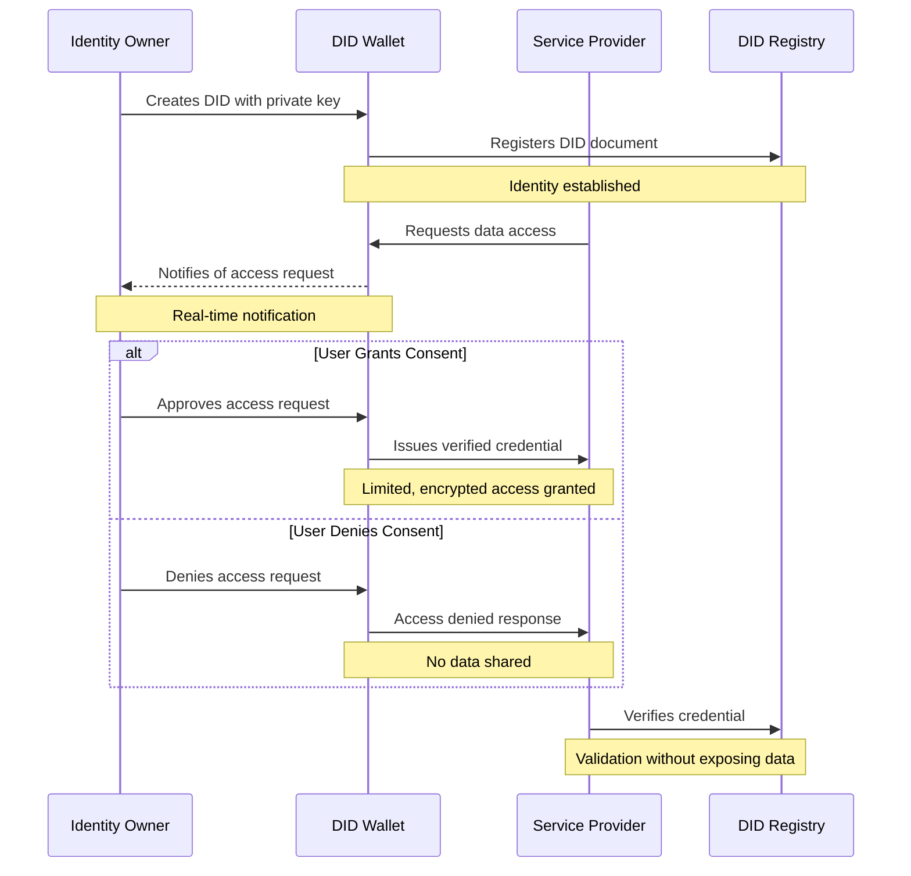
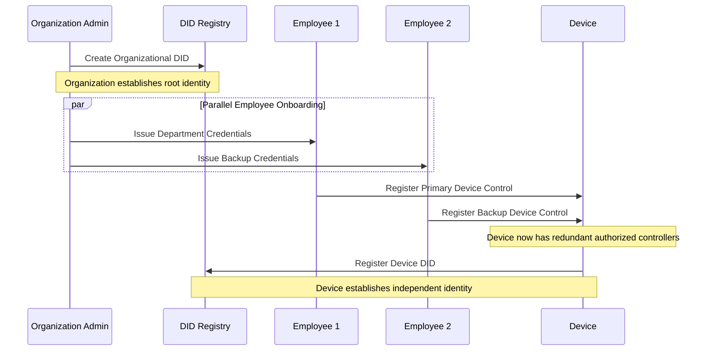
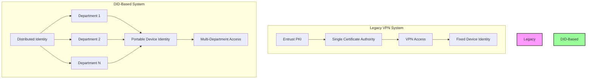

# Digital Identity Protection with VBI: Enterprise-Grade Decentralized Identity

## Introduction

In today's digital landscape, protecting identity has become crucial for both organizations and individuals. Traditional identity systems, built on centralized architectures, create vulnerabilities in enterprise security and leave employees with little control over their personal data. This implementation guide introduces a robust Decentralized Identifier (DID) system that revolutionizes how institutions and their workforce manage digital identity.

By treating organizational divisions, departments, and even individual roles as sovereign entities, this architecture creates a web of trust that enhances security while respecting privacy. Whether implemented in financial institutions, government agencies, or multinational corporations, this system ensures that digital assets and network access are secured through decentralized validation.

## Why Self-Sovereign Identity Matters for the Enterprise

Self-sovereign identity represents a paradigm shift in how organizations manage digital identities. Instead of maintaining vulnerable centralized databases of employee credentials, organizations can leverage a distributed architecture where both the institution and its employees maintain their own private keys and have complete visibility over access patterns.

### Key Benefits for Organizations

1. **Enhanced Security Architecture**

   - Departmental autonomy through independent key management
   - Reduced attack surface by eliminating central points of failure
   - Granular access control at division and role levels
2. **Institutional Trust Framework**

   - Verifiable credentials for inter-departmental access
   - Automated audit trails for compliance
   - Clear delegation of authority and responsibilities
3. **Operational Efficiency**

   - Streamlined onboarding and offboarding
   - Automated access management
   - Reduced administrative overhead

### Benefits for Employees and Departments

1. **Data Ownership**

   - Users retain control over their professional credentials
   - Complete visibility of data usage across the organization
   - Portable professional identity between roles
2. **Transparency**

   - Every data access attempt is logged and verified
   - All access requires explicit consent and validation
   - Clear visibility into data usage patterns
3. **Security**

   - Private key infrastructure ensures only authorized access
   - Multi-layer security protocols
   - Protection against unauthorized credential use
4. **Privacy**

   - Selective disclosure of role-specific information
   - Granular control over data sharing
   - Professional and personal data separation
5. **Consent Management**

   - Real-time notifications of access requests
   - Granular permission controls
   - Automated compliance tracking

## Enterprise Implementation Benefits

1. **For Financial Institutions**

   - Secure inter-departmental communication
   - Regulatory compliance through immutable audit trails
   - Protected access to sensitive financial data
2. **For Government Agencies**

   - Secure cross-agency collaboration
   - Verified official credentials
   - Transparent public service delivery
3. **For Healthcare Organizations**

   - HIPAA-compliant data access
   - Secure patient-provider interactions
   - Protected health information management
4. **For Multinational Corporations**

   - Standardized global identity management
   - Secure cross-border operations
   - Consistent access control across subsidiaries

## Advanced Security for Government and Law Enforcement

### Federal Government Implementation Benefits

1. **Inter-Agency Security**

   - Secure cross-department communication with verifiable credentials
   - Zero-trust architecture for sensitive document access
   - Protected inter-agency collaboration without central vulnerability points
2. **Classified Information Management**

   - Multi-level security clearance verification
   - Compartmentalized access control
   - Real-time access revocation capabilities
   - Granular audit trails for all classified data access

### Law Enforcement and Intelligence Agencies

1. **Field Operations Security**

   - Device-level protection through private key infrastructure
   - Biometric-enhanced authentication for field devices
   - Remote device invalidation capabilities
   - Secure cross-jurisdiction information sharing
2. **Cross-Border Operations**

   - Protected digital assets during international travel
   - Device security independent of physical possession
   - Immediate access revocation for compromised devices
   - Secure international agency collaboration
3. **Intelligence Asset Protection**

   - Compartmentalized information access
   - Cryptographic protection of field agent identities
   - Secure communication channels with embedded verification
   - Time-based access controls for sensitive operations

## Regulatory Compliance and Bureaucratic Efficiency

### Immediate Regulatory Benefits

1. **Automated Compliance**

   - Real-time regulatory reporting
   - Automated audit trail generation
   - Immutable record keeping
   - Standardized compliance verification
2. **Reduced Administrative Overhead**

   - Streamlined clearance verification processes
   - Automated access management
   - Digital credential verification
   - Paperless audit trails

### Long-term Bureaucratic Advantages

1. **Process Optimization**

   - Elimination of redundant verification steps
   - Automated cross-agency authorizations
   - Streamlined security clearance updates
   - Reduced manual intervention in access management
2. **Cost Reduction**

   - Decreased administrative staff requirements
   - Reduced paperwork processing
   - Lower compliance verification costs
   - Minimized security breach investigation costs

## Technical Benefits for Large Organizations

### Infrastructure Advantages

1. **Scalable Architecture**

   - Distributed processing capability
   - Horizontal scaling for growing organizations
   - Load-balanced authentication systems
   - Redundant verification nodes
2. **Operational Efficiency**

   - Automated key management
   - Streamlined access provisioning
   - Real-time security policy enforcement
   - Integrated compliance monitoring

### Security Enhancement

1. **Advanced Threat Protection**

   - Zero-trust security model implementation
   - Multi-factor authentication integration
   - Behavioral analytics capability
   - Real-time threat detection and response
2. **Device and Data Protection**

   - Hardware-level security integration
   - Secure enclave utilization
   - Protected key storage
   - Encrypted data transmission



## Key Security Features

The implementation ensures robust identity protection through:

- **Private Key Management**

  - Secure storage and management of private keys
  - Regular key rotation protocols
- **Consent Notifications**

  - Real-time alerts for data access requests
  - Detailed access attempt logging
- **Audit Trail**

  - Complete history of data access
  - Comprehensive consent decision tracking
- **Granular Permissions**

  - Fine-grained control over data sharing
  - Customizable access levels
- **Revocation**

  - Ability to revoke access at any time
  - Immediate effect across all systems

## Implementation Benefits

### Organizational Advantages

1. **Enhance Trust**

   - Build user confidence through transparent data handling
   - Clear audit trails and accountability
2. **Reduce Risk**

   - Minimize liability through user-controlled data
   - Reduce data breach exposure
3. **Improve Compliance**

   - Meet regulatory requirements
   - Automated compliance reporting
4. **Streamline Operations**

   - Automate identity verification
   - Simplified consent management
5. **Future-Proof**

   - Adopt emerging standards
   - Flexible architecture for future expansion

# Modern Government Identity Architecture: Device Portability and Security

## Current Challenges vs DID Solutions

Traditional government IT infrastructure faces several key challenges that a DID-based architecture directly addresses.

### Device Management Reform



### Legacy vs Modern Architecture Comparison



## Device Portability and Security

### Enhanced Device Management

1. **Single Device Policy**

   - One secure device per employee across departments
   - Dynamic credential management
   - Seamless department transitions
   - Maintained security posture across roles
2. **Security Layer Implementation**

   - Hardware Security Module (HSM) integration
   - Secure enclave for credential storage
   - Biometric authentication binding
   - Remote attestation capabilities
3. **Access Control**

   - Role-based access management
   - Department-specific security policies
   - Dynamic permission adjustment
   - Real-time access revocation

## Cost Analysis and Efficiency Gains

### Current Infrastructure Costs

1. **Hardware Expenditure**

   - Multiple devices per employee: $2,000-3,000 per device
   - Annual device management: $500-800 per device
   - Software licenses: $200-400 per device annually
   - Support costs: $300-500 per device annually
2. **PKI Infrastructure (e.g., Entrust)**

   - Annual licensing: $250,000-500,000
   - Certificate management: $100,000-200,000
   - Support contracts: $150,000-300,000
   - Infrastructure maintenance: $200,000-400,000

### DID Architecture Savings

1. **Device Reduction**

   - 60-80% reduction in device procurement
   - 70% reduction in device management costs
   - 50% reduction in support tickets
   - 40% reduction in IT staff requirements
2. **Infrastructure Savings**

   - Elimination of centralized PKI costs
   - Reduced certificate management overhead
   - Minimal infrastructure maintenance
   - Lower support requirements

## Implementation Benefits for Government Agencies

### Security Improvements

1. **Zero-Trust Architecture**

   - Device-level identity verification
   - Continuous authentication
   - Contextual access control
   - Real-time threat assessment
2. **Cross-Department Collaboration**

   - Secure interdepartmental access
   - Verified credential exchange
   - Automated access provisioning
   - Audit trail maintenance

### Operational Efficiency

1. **Employee Mobility**

   - Instant department transitions
   - Maintained security clearances
   - Portable device credentials
   - Unified access management
2. **Administrative Reduction**

   - Automated onboarding/offboarding
   - Self-service credential management
   - Reduced help desk requirements
   - Streamlined audit processes

## Legacy PKI Replacement

### Current Entrust Limitations

1. **Technical Constraints**

   - Single point of failure
   - Limited scalability
   - Outdated user interface
   - Complex certificate management
2. **Operational Issues**

   - High maintenance costs
   - Limited flexibility
   - Complex disaster recovery
   - Poor user experience

### DID Architecture Advantages

1. **Technical Benefits**

   - Distributed trust model
   - Infinite scalability
   - Modern interface
   - Automated management
2. **Operational Improvements**

   - Reduced costs
   - Enhanced flexibility
   - Built-in redundancy
   - Improved user experience

## Implementation Roadmap

1. **Phase 1: Infrastructure Setup**

   - DID network deployment
   - Security policy definition
   - Initial device enrollment
   - Pilot department selection
2. **Phase 2: Department Migration**

   - Gradual department onboarding
   - Legacy system phase-out
   - User training
   - Process documentation
3. **Phase 3: Full Deployment**

   - Complete system transition
   - Legacy system decommissioning
   - Performance monitoring
   - Continuous improvement

# Technical Implementation Guide

## Prerequisites

Before beginning the implementation, ensure you have:

- Azure subscription with B2C tenant
- Global administrator access to your Azure AD B2C tenant
- Azure CLI installed on your machine
- Digital Ocean account and access
- Development environment with Node.js installed

## 1. Azure B2C Setup

### Initial Configuration

```bash
# Install Azure CLI
curl -sL https://aka.ms/InstallAzureCLIDeb | sudo bash

# Login to Azure
az login

# Set your B2C tenant
az account set --subscription "your-subscription-name"
```

### Policy File Structure

1. Create a new directory for your policies:

```bash
mkdir b2c-policies
cd b2c-policies
```

2. Create the following required files:

- `TrustFrameworkBase.xml`
- `TrustFrameworkExtensions.xml`
- `SignUpOrSignIn.xml`
- `PasswordReset.xml`
- `ProfileEdit.xml`

### Base Policy Configuration

Create `TrustFrameworkBase.xml`:

```xml
<?xml version="1.0" encoding="UTF-8" standalone="yes"?>
<TrustFrameworkPolicy xmlns="http://schemas.microsoft.com/online/cpim/schemas/2013/06"
  PolicySchemaVersion="0.3.0.0"
  TenantId="yourtenant.onmicrosoft.com"
  PolicyId="B2C_1A_TrustFrameworkBase"
  PublicPolicyUri="http://yourtenant.onmicrosoft.com/B2C_1A_TrustFrameworkBase">

  <BuildingBlocks>
    <ClaimsSchema>
      <ClaimType Id="didIdentifier">
        <DisplayName>DID Identifier</DisplayName>
        <DataType>string</DataType>
      </ClaimType>
    </ClaimsSchema>
  </BuildingBlocks>
</TrustFrameworkPolicy>
```

## 2. Policy Deployment

### Environment Setup

1. Set environment variables:

```bash
# Set variables
B2C_TENANT="yourtenant.onmicrosoft.com"
POLICY_PATH="./b2c-policies"
```

2. Deploy policies in sequence:

```bash
# Upload policies in correct order
az policy upload \
  --tenant-name $B2C_TENANT \
  --policy-path "$POLICY_PATH/TrustFrameworkBase.xml"

az policy upload \
  --tenant-name $B2C_TENANT \
  --policy-path "$POLICY_PATH/TrustFrameworkExtensions.xml"

az policy upload \
  --tenant-name $B2C_TENANT \
  --policy-path "$POLICY_PATH/SignUpOrSignIn.xml"
```

## 3. DID Journey Configuration

### Journey Setup

Create `did-journey.xml` with the following structure:

```xml
<?xml version="1.0" encoding="UTF-8" standalone="yes"?>
<TrustFrameworkPolicy xmlns="http://schemas.microsoft.com/online/cpim/schemas/2013/06"
  PolicySchemaVersion="0.3.0.0"
  TenantId="yourtenant.onmicrosoft.com"
  PolicyId="B2C_1A_DID_SIGNUP_SIGNIN"
  PublicPolicyUri="http://yourtenant.onmicrosoft.com/B2C_1A_DID_SIGNUP_SIGNIN">

  <BasePolicy>
    <TenantId>yourtenant.onmicrosoft.com</TenantId>
    <PolicyId>B2C_1A_TrustFrameworkExtensions</PolicyId>
  </BasePolicy>

  <UserJourneys>
    <UserJourney Id="SignUpOrSignInWithDID">
      <OrchestrationSteps>
        <!-- Step 1: Check DID -->
        <OrchestrationStep Order="1" Type="ClaimsExchange">
          <ClaimsExchanges>
            <ClaimsExchange Id="DIDVerification" TechnicalProfileReferenceId="DID-Validation" />
          </ClaimsExchanges>
        </OrchestrationStep>

        <!-- Step 2: Sign up or sign in -->
        <OrchestrationStep Order="2" Type="ClaimsExchange">
          <ClaimsExchanges>
            <ClaimsExchange Id="SignUpOrSignIn" TechnicalProfileReferenceId="LocalAccountSignUpWithLogonEmail" />
          </ClaimsExchanges>
        </OrchestrationStep>

        <!-- Step 3: Issue token -->
        <OrchestrationStep Order="3" Type="SendClaims" CpimIssuerTechnicalProfileReferenceId="JwtIssuer" />
      </OrchestrationSteps>
    </UserJourney>
  </UserJourneys>
</TrustFrameworkPolicy>
```

## 4. Azure Portal Configuration

### Portal Setup Steps

1. **Access Configuration**

   - Navigate to Azure Portal
   - Select your B2C tenant
   - Open "Identity Experience Framework"
2. **Key Configuration**

   - Select "Policy Keys"
   - Add required keys:
     - Token signing key
     - Token encryption key
     - Identity provider keys (if applicable)

### Policy Testing

1. **Initial Test**

   - Navigate to B2C tenant
   - Select "Identity Experience Framework"
   - Click on your policy (B2C_1A_DID_SIGNUP_SIGNIN)
   - Select "Run now"
2. **Verification Steps**

   - Confirm policy uploads successfully
   - Verify technical profiles
   - Test DID validation endpoint
   - Check claims mapping
   - Validate user journey flow

## 5. Troubleshooting Guide

### Common Issues

1. **Policy Upload Failures**

```bash
# Validate policy XML
az policy validate \
  --tenant-name $B2C_TENANT \
  --policy-path "$POLICY_PATH/your-policy.xml"
```

2. **DID Validation Issues**

   - Check endpoint URL in technical profile
   - Verify service status
   - Confirm network connectivity
3. **Claims Configuration**

   - Verify schema matches application
   - Validate input/output mapping
   - Check transformation rules

# Infrastructure Setup and Security Configuration

## 1. Digital Ocean Infrastructure

### ION Node Setup

1. **Prepare Ubuntu Droplet**:

```bash
# Update system and install Docker
sudo apt update
sudo apt install -y docker.io docker-compose
```

2. **Configure ION Node**:

```yaml
# docker-compose.yml
version: '3'
services:
  ion-node:
    image: identityfoundation/ion-node
    ports:
      - "3000:3000"
    volumes:
      - ./data:/data
    environment:
      - MONGODB_URI=mongodb://mongodb:27017/ion
      - BITCOIN_RPC_URL=http://bitcoin:8332
  
  mongodb:
    image: mongo:4.4
    volumes:
      - ./mongodb:/data/db
```

3. **Launch Services**:

```bash
# Start the ION node
docker-compose up -d
```

### Web Application Deployment

1. **Application Configuration**:

```yaml
# app-config.yml
name: did-verification-app
services:
  - name: web
    github:
      repo: your-repo/did-verification
      branch: main
      deploy_on_push: true
    build_command: npm run build
    run_command: npm start
    envs:
      - key: NODE_ENV
        value: production
      - key: ION_NODE_URL
        value: ${_self.PRIVATE_IP}:3000
      - key: AZURE_TENANT_ID
        scope: RUN_TIME
        value: YOUR_TENANT_ID
      - key: AZURE_CLIENT_ID
        scope: RUN_TIME
        value: YOUR_CLIENT_ID
```

2. **Database Configuration**:

```yaml
databases:
  - name: mongodb
    engine: MONGODB
    version: "4.4"
```

## 2. Security Implementation

### Key Management Setup

1. **Azure Key Vault Configuration**:

```bash
# Create Key Vault
az keyvault create \
    --name did-key-vault \
    --resource-group your-resource-group \
    --location eastus

# Configure access policy
az keyvault set-policy \
    --name did-key-vault \
    --object-id <YOUR_APP_OBJECT_ID> \
    --secret-permissions get set list
```

2. **Key Management Service Implementation**:

```javascript
const { DefaultAzureCredential } = require('@azure/identity');
const { KeyClient } = require('@azure/keyvault-keys');

class KeyManagementService {
    constructor() {
        this.credential = new DefaultAzureCredential();
        this.vaultUrl = `https://did-key-vault.vault.azure.net`;
        this.keyClient = new KeyClient(this.vaultUrl, this.credential);
    }

    async generateKeyPair(keyName) {
        try {
            const key = await this.keyClient.createKey(keyName, 'EC', {
                curve: 'P-256K',
                exportable: false,
                keyOps: ['sign', 'verify']
            });
            return {
                keyId: key.id,
                publicKey: key.key.x
            };
        } catch (error) {
            console.error('Key generation failed:', error);
            throw error;
        }
    }
}
```

### Security Headers Configuration

```javascript
const securityHeaders = {
    strictTransportSecurity: {
        maxAge: 31536000,
        includeSubDomains: true,
        preload: true
    },
    contentSecurityPolicy: {
        directives: {
            defaultSrc: ["'self'"],
            scriptSrc: ["'self'", "'strict-dynamic'"],
            styleSrc: ["'self'", "'unsafe-inline'"],
            imgSrc: ["'self'", "data:", "https:"],
            connectSrc: ["'self'", "https://*.b2clogin.com"],
            frameSrc: ["'none'"],
            objectSrc: ["'none'"]
        }
    }
};
```

## 3. Document Verification Portal Setup

### Face Verification Service

1. **Install Dependencies**:

```bash
npm install @azure/cognitiveservices-face @azure/ms-rest-azure-js
```

2. **Service Implementation**:

```javascript
class FaceVerificationService {
    constructor() {
        this.credentials = new CognitiveServicesCredentials(
            process.env.FACE_API_KEY
        );
        this.faceClient = new FaceClient(
            this.credentials, 
            process.env.FACE_API_ENDPOINT
        );
    }

    async verifyIdentity(idImage, selfieImage) {
        try {
            // Detect faces in ID document
            const idFace = await this.faceClient.face.detectWithStream(
                idImage,
                { returnFaceId: true }
            );

            // Detect faces in selfie
            const selfieFace = await this.faceClient.face.detectWithStream(
                selfieImage,
                { returnFaceId: true }
            );

            // Verify faces match
            return await this.faceClient.face.verifyFaceToFace(
                idFace[0].faceId,
                selfieFace[0].faceId
            );
        } catch (error) {
            console.error('Face verification failed:', error);
            throw error;
        }
    }
}
```

### Secure Document Upload

1. **Upload Service Configuration**:

```javascript
class DocumentUploadService {
    constructor() {
        this.blobServiceClient = BlobServiceClient.fromConnectionString(
            process.env.AZURE_STORAGE_CONNECTION_STRING
        );
        this.containerClient = this.blobServiceClient.getContainerClient('documents');
    }

    getUploadMiddleware() {
        return multer({
            storage: multer.memoryStorage(),
            limits: {
                fileSize: 5 * 1024 * 1024, // 5MB limit
                files: 2 // ID and selfie only
            },
            fileFilter: this.fileFilter
        });
    }

    fileFilter(req, file, cb) {
        if (!file.mimetype.startsWith('image/')) {
            return cb(new Error('Only images are allowed'));
        }
        cb(null, true);
    }
}
```

## 4. Session Management

### Redis Configuration

```javascript
const redis = new Redis({
    host: process.env.REDIS_HOST,
    port: process.env.REDIS_PORT,
    password: process.env.REDIS_PASSWORD,
    tls: process.env.NODE_ENV === 'production' ? {} : undefined
});

const sessionConfig = {
    store: new RedisStore({ client: redis }),
    secret: process.env.SESSION_SECRET,
    name: 'did.sid',
    cookie: {
        maxAge: 24 * 60 * 60 * 1000, // 24 hours
        httpOnly: true,
        secure: process.env.NODE_ENV === 'production',
        sameSite: 'strict'
    },
    resave: false,
    saveUninitialized: false
};
```

### Security Middleware Chain

```javascript
const securityMiddleware = [
    helmet(),
    cors({
        origin: process.env.ALLOWED_ORIGINS.split(','),
        credentials: true
    }),
    rateLimiter.middleware({
        points: 10,
        duration: 1
    })
];
```

## 5. Monitoring and Logging

### Application Insights Setup

1. **Configuration**:

```javascript
const appInsights = require('applicationinsights');

appInsights.setup(process.env.APPLICATIONINSIGHTS_CONNECTION_STRING)
    .setAutoDependencyCorrelation(true)
    .setAutoCollectRequests(true)
    .setAutoCollectPerformance(true)
    .setAutoCollectExceptions(true)
    .start();
```

2. **Custom Logging Implementation**:

```javascript
const logger = winston.createLogger({
    level: 'info',
    format: winston.format.combine(
        winston.format.timestamp(),
        winston.format.json()
    ),
    transports: [
        new winston.transports.File({ 
            filename: 'error.log', 
            level: 'error' 
        }),
        new winston.transports.File({ 
            filename: 'combined.log' 
        })
    ]
});
```

### Health Check Implementation

```javascript
app.get('/health', async (req, res) => {
    const health = {
        uptime: process.uptime(),
        status: 'OK',
        timestamp: Date.now(),
        services: {
            database: await checkDatabaseHealth(),
            redis: await checkRedisHealth(),
            azure: await checkAzureServices()
        }
    };
    res.status(200).send(health);
});
```

## 6. Security Testing Procedures

### Automated Security Testing

1. **Test Suite Configuration**:

```javascript
// tests/security/main.test.js
describe('Security Infrastructure Tests', () => {
    describe('Authentication', () => {
        test('should enforce rate limiting on auth endpoints', async () => {
            for (let i = 0; i < 6; i++) {
                const response = await request(app)
                    .post('/auth/login')
                    .send({ /* test credentials */ });
                if (i === 5) {
                    expect(response.status).toBe(429);
                }
            }
        });

        test('should properly handle failed auth attempts', async () => {
            // Test implementation
        });
    });

    describe('DID Verification', () => {
        test('should validate DID format', async () => {
            // Test implementation
        });
    });
});
```

### Manual Security Checklist

```markdown
## Pre-Release Security Verification

### Authentication
- [ ] Test rate limiting thresholds
- [ ] Verify account lockout functionality
- [ ] Check password policy enforcement
- [ ] Test multi-factor authentication flow
- [ ] Verify session timeout settings

### DID Operations
- [ ] Validate DID creation process
- [ ] Test DID verification endpoints
- [ ] Check revocation mechanisms
- [ ] Verify consent management flow

### API Security
- [ ] Verify all endpoints require authentication
- [ ] Test CORS configurations
- [ ] Validate request/response encryption
- [ ] Check rate limiting on all endpoints
```

## 7. Deployment Procedures

### Pre-Deployment Checklist

```markdown
## Deployment Security Checklist

### Environment Verification
- [ ] Audit all dependencies for vulnerabilities
- [ ] Verify all environment variables
- [ ] Check SSL/TLS certificates
- [ ] Review security configurations

### Infrastructure Setup
- [ ] Configure network security groups
- [ ] Set up WAF rules
- [ ] Enable DDoS protection
- [ ] Configure backup systems

### Monitoring Setup
- [ ] Enable audit logging
- [ ] Configure alert thresholds
- [ ] Set up performance monitoring
- [ ] Verify logging retention policies
```

### Deployment Script

```bash
#!/bin/bash
# deploy-security.sh

echo "Starting security deployment..."

# Pre-deployment checks
echo "Running security checks..."
npm audit
snyk test

# Deploy security configurations
echo "Applying security configurations..."
kubectl apply -f security/

# Verify deployment
echo "Verifying security setup..."
./scripts/verify-security.sh
```

## 8. Incident Response

### Response Plan Structure

```yaml
# incident-response-plan.yml
response_procedures:
  security_breach:
    immediate_actions:
      - isolate_affected_systems
      - notify_security_team
      - begin_logging_enhancement
    investigation:
      - collect_system_logs
      - analyze_attack_vectors
      - document_findings
    remediation:
      - patch_vulnerabilities
      - update_security_rules
      - rotate_credentials
    recovery:
      - restore_systems
      - verify_integrity
      - document_lessons

  suspicious_activity:
    detection:
      - monitor_abnormal_patterns
      - analyze_traffic_logs
      - verify_authenticity
    response:
      - block_suspicious_ips
      - enhance_monitoring
      - update_security_rules
```

### Implementation

```javascript
class IncidentResponseManager {
    async handleIncident(type, details) {
        await this.logIncident(type, details);
        await this.notifyTeam(type, details);
        await this.initiateResponse(type, details);
    }

    async initiateResponse(type, details) {
        switch(type) {
            case 'security_breach':
                await this.handleSecurityBreach(details);
                break;
            case 'suspicious_activity':
                await this.handleSuspiciousActivity(details);
                break;
            default:
                await this.handleGenericIncident(type, details);
        }
    }
}
```

## 9. Performance Monitoring

### Metrics Configuration

```javascript
const metrics = {
    didOperations: {
        created: new Counter({
            name: 'did_operations_created',
            help: 'Number of DIDs created'
        }),
        verified: new Counter({
            name: 'did_operations_verified',
            help: 'Number of DIDs verified'
        }),
        failed: new Counter({
            name: 'did_operations_failed',
            help: 'Number of failed DID operations'
        })
    },
    performance: {
        responseTime: new Histogram({
            name: 'api_response_time',
            help: 'API response time in seconds',
            buckets: [0.1, 0.5, 1, 2, 5]
        })
    }
};
```

### Monitoring Dashboard Definition

```json
{
  "dashboard": {
    "panels": [
      {
        "title": "DID Operations Overview",
        "type": "graph",
        "datasource": "Prometheus",
        "targets": [
          {
            "expr": "rate(did_operations_created[5m])",
            "legendFormat": "Creation Rate"
          },
          {
            "expr": "rate(did_operations_failed[5m])",
            "legendFormat": "Failure Rate"
          }
        ]
      }
    ]
  }
}
```
