# **🚀 Logging into Windows, Mac, and Linux, and app access control with Decentralized Identity (`DID:web`)**

## **📌 Overview**

By integrating **DID-based authentication** into  **Windows, Mac, and Linux login systems** , organizations can enable **passwordless authentication** using **verifiable credentials (VCs)** issued via  **DID:web** . This provides **secure, decentralized identity verification** that eliminates the need for **passwords** while ensuring **fine-grained access control** at multiple levels.

## **🔹 How It Works**

* Users **log into their machine** (Windows, Mac, Linux) using their  **DID-based verifiable credential** .
* The machine **challenges the user to approve login** via **biometrics (FaceID, fingerprint, Windows Hello)** or  **a secure hardware key (e.g., YubiKey, Ledger, TPM)** .
* Once authenticated, the **DID payload** includes  **access permissions and roles** , allowing **network access and app-level authentication**  **without requiring apps to be refactored** .

---

## **1️⃣ Logging Into Windows, Mac, or Linux with DID-based Authentication**

### **🔹 Windows Integration (Active Directory + Windows Hello)**

* **Windows Hello** supports passwordless authentication with FIDO2/WebAuthn.
* Users log into Windows using their **DID-based verifiable credential** issued via  **Azure Entra External ID, Keycloak, or OpenAM** .
* If the  **credential is valid** , the system unlocks based on  **biometric authentication (Face ID, fingerprint) or a YubiKey** .

#### **📌 How to Enable DID-based Login for Windows**

1. **Install the FIDO2 Security Key Support in Active Directory**
   ```powershell
   dsregcmd /status
   ```
2. **Enable Windows Hello for Business**
   ```powershell
   New-AdfsWebAuthnPolicy -Enable -AllowAllRegisteredAuthenticators
   ```
3. **Register the DID-based Verifiable Credential**
   * Issue the **DID-based credential** to the user.
   * Store it in **Windows Credential Manager** or use **a Wallet app** like  **Entra Verified ID or Keycloak Wallet** .
4. **Test Login with DID**
   * On the login screen, select  **"Use Security Key"** .
   * Insert  **YubiKey or authenticate with biometric verification** .

---

### **🔹 MacOS Integration (Login with Verifiable Credential)**

* **MacOS supports WebAuthn & FIDO2-based authentication** via  **Touch ID, Face ID, or YubiKey** .
* Users authenticate with **a DID-based verifiable credential** stored in their  **Mac Keychain or Entra Wallet** .

#### **📌 Steps to Enable DID-based Login on Mac**

1. Open  **System Preferences → Users & Groups** .
2. Enable **"Sign in with Security Key"** under Authentication Methods.
3. Use  **DID-based authentication via a WebAuthn Wallet** .

---

### **🔹 Linux Integration (PAM Authentication with DID)**

Linux users can authenticate via **PAM (Pluggable Authentication Module)** using  **DID-based credentials** .

#### **📌 Steps to Enable DID-based Login on Linux**

1. **Install PAM-WebAuthn Module**

   ```bash
   sudo apt install libpam-webauthn
   ```
2. **Register DID-based Credential**

   ```bash
   pamu2fcfg > ~/.config/security-key
   ```
3. **Enable PAM Authentication**

   * Edit `/etc/pam.d/common-auth`

   ```bash
   auth required pam_webauthn.so
   ```

Now, users can log in using  **a verifiable credential + biometric authentication or YubiKey** .

---

## **2️⃣ Logging and Auditing User Access**

Each **login event** is  **recorded in an auditable ledger** , ensuring **traceability** and  **security** .

### **🔹 How Access Logs Work**

| Event                                       | Logged Data                            |
| ------------------------------------------- | -------------------------------------- |
| **User Login**                        | DID used, device info, timestamp       |
| **Failed Login Attempt**              | Rejected credential, timestamp         |
| **Network Access**                    | Apps & services accessed               |
| **Biometric Authentication Approval** | Face/Fingerprint used, success/failure |
| **Hardware Key Approval**             | YubiKey/Ledger device used             |

Example log entry:

```json
{
  "event": "User Login",
  "user": "did:web:example.com:user123",
  "device": "MacOS",
  "authentication_method": "FaceID",
  "timestamp": "2025-01-28T12:34:56Z"
}
```

---

## **3️⃣ Extending DID Payload for Access Control**

Administrators can **extend the DID payload** to  **include roles and permissions** , allowing  **app-level authentication without app refactoring** .

### **🔹 Example Extended DID Payload**

```json
{
  "id": "did:web:example.com:user123",
  "verificationMethod": [
    {
      "id": "did:web:example.com:user123#key-1",
      "type": "JsonWebKey2020",
      "controller": "did:web:example.com",
      "publicKeyJwk": { "kty": "EC", "crv": "P-256", "x": "public-key-x", "y": "public-key-y" }
    }
  ],
  "authentication": ["did:web:example.com:user123#key-1"],
  "role": "admin",
  "permissions": ["network_access", "app_access:HR", "app_access:Finance"]
}
```

---


## **🔹 Expanding the Extended DID Payload for Entra ID Security Groups & App Access**

This section expands on **how the extended DID payload integrates with Microsoft Entra ID (Azure AD) Security Groups** and how **enterprise apps in a domain** can **challenge a DID-based credential** to verify a user's access.

---

## **📌 Overview**

To  **seamlessly integrate DIDs into Microsoft Entra ID security groups and app-level access** , we must:

1. **Embed security group information** into the  **DID payload** .
2. **Enable Entra ID & enterprise applications** to  **verify the DID payload** .
3. **Dynamically challenge users based on their DID** before granting access.
4. **Enforce fine-grained access control** without  **modifying applications** .

---

## **1️⃣ Extended DID Payload with Entra ID Security Group Integration**

The **DID payload** can be extended to include **security groups** that map to  **Entra ID roles and app permissions** .

### **🔹 Example Extended DID Payload**

```json
{
  "id": "did:web:example.com:user123",
  "verificationMethod": [
    {
      "id": "did:web:example.com:user123#key-1",
      "type": "JsonWebKey2020",
      "controller": "did:web:example.com",
      "publicKeyJwk": { "kty": "EC", "crv": "P-256", "x": "public-key-x", "y": "public-key-y" }
    }
  ],
  "authentication": ["did:web:example.com:user123#key-1"],
  "securityGroups": [
    {
      "id": "SG-IT-Admins",
      "role": "Administrator",
      "entraIDGroupID": "aad-group-123456",
      "permissions": ["network_access", "app_access:HR", "app_access:Finance"]
    },
    {
      "id": "SG-Developers",
      "role": "Developer",
      "entraIDGroupID": "aad-group-789101",
      "permissions": ["network_access", "app_access:DevOps", "app_access:SourceControl"]
    }
  ],
  "organization": {
    "id": "example.com",
    "domain": "example.com",
    "verified": true
  }
}
```

---

## **2️⃣ How Entra ID Security Groups Verify a DID Credential**

To integrate **Entra ID security groups** with  **DID-based authentication** , the following steps occur:

1. **User presents their DID credential** to the application.
2. **The application checks the DID payload** for `securityGroups`.
3. **The app sends a verification request to Entra ID** , checking if the `entraIDGroupID` exists in the organization’s Entra ID tenant.
4. **Entra ID validates the user’s group membership** and **issues an access token** with relevant permissions.
5. **The app enforces access control based on DID attributes** .

---

## **3️⃣ Authentication Flow with Entra ID Security Groups & DID Challenge**

The following **Mermaid.js diagram** illustrates **how an enterprise app enforces authentication** using  **DID credentials & Entra ID groups** .

```mermaid
sequenceDiagram
    participant User
    participant EnterpriseApp as Enterprise Application
    participant DIDVerifier as DID Verification Service
    participant EntraID as Microsoft Entra ID
    participant Wallet as User Wallet (Entra, Keycloak, YubiKey)

    User->>EnterpriseApp: Request Access (e.g., HR System)
    EnterpriseApp-->>DIDVerifier: Challenge User's DID Credential
    DIDVerifier->>Wallet: Request Biometric/YubiKey Approval
    Wallet-->>DIDVerifier: Biometric/YubiKey Authenticated ✅
    DIDVerifier-->>EnterpriseApp: DID Verified ✅
    EnterpriseApp-->>EntraID: Validate User’s Security Groups
    EntraID-->>EnterpriseApp: User Belongs to SG-IT-Admins ✅
    EnterpriseApp-->>User: Access Granted ✅
```



---

## **4️⃣ How Enterprise Apps Enforce Access Based on DID & Entra ID**

* **When a user attempts to access an application** , the  **application first checks the Entra ID Security Groups** .
* **Instead of using a traditional login/password** , the  **application challenges the user’s DID credential** .
* The **user approves the challenge** via  **biometric authentication or YubiKey** .
* If the  **user’s DID payload contains a valid security group** ,  **Entra ID authorizes the session** .

### **🔹 Example Access Control Logic (OAuth Token Exchange)**

When **an enterprise app** verifies a  **DID credential** , it requests  **Entra ID to verify security groups** .

#### **📌 OAuth Token Request with DID Challenge**

```http
POST https://login.microsoftonline.com/{tenant_id}/oauth2/v2.0/token
Content-Type: application/json

{
  "grant_type": "urn:ietf:params:oauth:grant-type:jwt-bearer",
  "assertion": "<DID_CREDENTIAL>",
  "client_id": "enterprise-app-client-id",
  "scope": "user.read group.read.all",
  "requested_token_use": "on_behalf_of"
}
```

#### **📌 Entra ID Token Response**

```json
{
  "access_token": "<jwt-access-token>",
  "token_type": "Bearer",
  "expires_in": 3600,
  "scope": "user.read group.read.all",
  "groups": [
    "aad-group-123456",
    "aad-group-789101"
  ]
}
```

---

## **5️⃣ How to Enforce App & Network Access Without Refactoring Apps**

Instead of modifying  **each individual app** , **a centralized access control tool** can be used to enforce authentication at the  **network & device level** .

### **🔹 Using Entra ID Conditional Access with Verifiable Credentials**

1. **DID-based authentication is required before granting access** .
2. **The network or VPN enforces conditional access based on Entra ID security groups** .
3. **If the user’s DID is verified, they gain access** to apps  **without needing refactoring** .

#### **📌 Example: Enforcing Conditional Access in Entra ID**

1. Navigate to **Microsoft Entra Admin Center** →  **Conditional Access** .
2. Create a new policy:
   * **Assignments → Users and Groups** → Require group  **SG-IT-Admins** .
   * **Conditions → Client Apps** → Require  **DID-based authentication** .
   * **Access Controls → Grant** → Require **Multi-Factor Authentication** (MFA).
3. Save & apply the policy.

---

## **6️⃣ Enforcing DID-based Authentication with Biometric & Hardware Verification**

### **🔹 How Users Approve Authentication**

* **Option 1: Biometric Authentication**
  * **Windows Hello, Mac Touch ID, Face ID** validate the user’s  **DID-based credential** .
  * Once verified,  **access is granted** .
* **Option 2: Hardware Security Keys (YubiKey)**
  * The  **DID credential is stored on a hardware key** .
  * When prompted, the user must **insert and tap the key** to approve access.

---

## **7️⃣ Use Case: Enforcing DID-Based Authentication Across an Enterprise**

| Scenario                                               | Authentication Process                                   |
| ------------------------------------------------------ | -------------------------------------------------------- |
| **User Logs into Windows/macOS/Linux**           | **DID-based login via Entra ID verification**      |
| **User Connects to VPN or Network**              | **Entra ID Conditional Access challenges the DID** |
| **User Opens Enterprise CRM (e.g., Salesforce)** | **App validates DID credential + Security Group**  |
| **User Accesses Secure Finance Data**            | **App forces biometric approval or YubiKey**       |

---

## **🚀 Conclusion**

✅  **DID-based authentication can integrate with Entra ID security groups** .

✅  **Users authenticate using biometrics (Face ID, Windows Hello) or YubiKey** .

✅  **No need to refactor apps – authentication happens at the network & OS level** .

✅  **Enterprise apps automatically challenge DIDs & verify permissions** .

✅  **All access attempts are logged in an auditable format** .


## **4️⃣ Controlling Access to Apps & Network Assets**

With  **DID-based authentication** , organizations can  **control access at multiple levels** .

| Access Level                                          | Authentication Method                              |
| ----------------------------------------------------- | -------------------------------------------------- |
| **Device (Windows, Mac, Linux Login)**          | **DID + Face Recognition or YubiKey**        |
| **Network (VPN, Wi-Fi, Firewall Access)**       | **DID-based Network Authentication**         |
| **Application Access (HR, Finance, CRM, etc.)** | **DID-Based Challenge + Biometric Approval** |

---

## **5️⃣ Enforcing Verifiable Credential Challenges for Apps**

When a user attempts to access an  **enterprise app or system** , the app **automatically challenges** their  **verifiable credential** .

### **🔹 Challenge Flow**

```mermaid
sequenceDiagram
    participant User
    participant OS as Windows/Mac/Linux OS
    participant EnterpriseApp as Business Application
    participant DIDVerifier as DID Verification Service
    participant Wallet as User Wallet (Entra, Keycloak, YubiKey)

    User->>OS: Login with DID Credential
    OS-->>DIDVerifier: Validate DID
    DIDVerifier-->>OS: DID Verified ✅
    OS->>EnterpriseApp: Request Access to HR System
    EnterpriseApp-->>DIDVerifier: Challenge User's DID
    DIDVerifier->>Wallet: Request Biometric/YubiKey Approval
    Wallet-->>DIDVerifier: Biometric/YubiKey Authenticated ✅
    DIDVerifier-->>EnterpriseApp: Grant Access ✅
    EnterpriseApp->>User: Access Granted ✅
```



---

## **6️⃣ Authentication with Biometrics & Hardware Devices**

Users can **approve authentication requests** using:

* **Biometric Wallets** (Windows Hello, Mac TouchID, Face ID)
* **Hardware Security Keys** (YubiKey, Ledger)

### **🔹 Example: Approving a Challenge with a Wallet**

1. User logs in to  **Windows/macOS/Linux** .
2. They try to access  **an enterprise app** .
3. The  **app challenges their DID** .
4. The user **approves authentication** via  **FaceID, fingerprint, or YubiKey** .
5. **Access is granted** ✅.

---

## **🚀 Conclusion**

✅ **Passwordless Authentication** across  **Windows, Mac, and Linux** .

✅ **Fine-Grained Access Control** without modifying apps.

✅ **DID Payload Extensions** for  **roles & permissions** .

✅ **Auditable Logs** to track all user activities.

✅ **Multi-Factor Authentication (MFA)** using  **biometrics or YubiKeys** .
