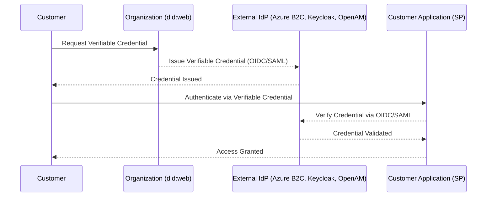

# **Integrating `did:web` with External Identity Providers (Azure B2C, OpenAM, Keycloak, Entra External ID, Linux LDAP)**

## **📌 Overview**

Decentralized Identity (`did:web`) enables  **organizations to issue verifiable credentials (VCs) for external customers** , allowing them to authenticate  **without relying on traditional username/password systems** . This repository provides **setup instructions** for integrating `did:web` with various external Identity Providers ( **IdPs** ), including:

✅ **Azure B2C** – Microsoft’s identity solution for customer authentication

✅ **Keycloak** – Open-source OIDC & SAML identity provider

✅ **OpenAM** – ForgeRock’s identity and access management solution

✅ **Entra External ID** – Microsoft’s cross-organizational authentication platform

✅ **Linux LDAP** – Authentication via enterprise directory services

📌 **[Setup Guide](https://github.com/Cloudstrucc/cs-identity/blob/main/did-web-external-idp.md)**

---

## **💡 Why Use `did:web` for External Customers?**

Unlike centralized authentication (username/password),  **DID:web provides** :

✅ **User-Owned Identities** – Customers control their digital identity without needing to store passwords.

✅ **Interoperability** – Works across  **OIDC, SAML, and LDAP-based providers** .

✅ **Privacy-Preserving** – No unnecessary user data is stored in authentication databases.

✅ **Passwordless Authentication** – Reduces **phishing risks** while improving security.

✅ **Multi-Tenant Support** – Customers authenticate using  **their own decentralized identity** .

---

## **⚙️ Authentication Flow with External Identity Providers**

The following **Mermaid.js diagram** shows how `did:web` integrates with  **OIDC/SAML providers** .



📌 This shows how customers authenticate  **without passwords** , using `did:web` credentials within  **Azure B2C, Keycloak, OpenAM, or LDAP** .

---

## **1️⃣ Setting Up `did:web` for External Authentication**

Before integrating with identity providers, set up a **DID:web identifier** for your organization.

### **Step 1: Install `didkit`**

```bash
npm install -g didkit-cli
```

OR

```bash
cargo install didkit
```

### **Step 2: Generate `did:web`**

```bash
didkit generate-did web https://example.com
```

Save the output as `did.json` and host it on:

```
https://example.com/.well-known/did.json
```

### **Step 3: Verify `did:web`**

```bash
curl https://example.com/.well-known/did.json
```

If it returns a valid JSON response, **your DID is now live!** 🚀

---

## **2️⃣ Configuring External Identity Providers**

Each IdP must be  **configured to verify Verifiable Credentials issued via `did:web`** .

### **🔹 Azure B2C**

📌  **Use Case** : Authenticate customers via OIDC with `did:web` credentials.

#### **Step 1: Enable Azure B2C Identity Providers**

1. Sign in to **Azure Portal** →  **Azure AD B2C** .
2. Navigate to **Identity Providers** →  **Custom OIDC** .
3. Click **+ New Provider** → Select  **OIDC** .

#### **Step 2: Configure OIDC Settings**

* **Issuer URL** : `https://example.com/.well-known/did.json`
* **Client ID** : Your B2C Application Client ID
* **Client Secret** : Your OIDC secret
* **Scopes** : `openid`, `profile`, `did_auth`
* **Response Type** : `id_token`

#### **Step 3: Add a User Flow**

1. **Create a Sign-in Flow** :

* Navigate to **User Flows** →  **New Sign-in Flow** .
* Select  **OIDC-based authentication** .
* Link the **Custom OIDC Provider** (`did:web`).
* Save and test authentication.

---

### **🔹 Keycloak**

📌  **Use Case** : Enable DID-based OIDC login for external users.

#### **Step 1: Configure Keycloak for `did:web`**

1. Log in to  **Keycloak Admin Console** .
2. Navigate to **Identity Providers** →  **OpenID Connect v1.0** .
3. Set the following:
   * **Authorization URL** : `https://example.com/.well-known/did.json`
   * **Token Endpoint** : `https://example.com/token`
   * **User Info Endpoint** : `https://example.com/userinfo`
   * **Client ID** : `did-web-client`
   * **Client Secret** : `your-secret`
4. **Save and test login** .

---

### **🔹 OpenAM (ForgeRock)**

📌  **Use Case** : Authenticate customers via SAML with `did:web`.

#### **Step 1: Configure OpenAM SAML Identity Provider**

1. Log in to  **ForgeRock OpenAM** .
2. Navigate to **Identity Providers** →  **New SAML Provider** .
3. Enter:
   * **Issuer** : `did:web:example.com`
   * **Assertion Consumer Service URL** : `https://example.com/assertion`
   * **Signing Key** : Public Key from `did.json`
4. **Enable SAML-based authentication** .

---

### **🔹 Entra External ID**

📌  **Use Case** : Cross-organization authentication with Microsoft.

1. Navigate to **Entra External ID** →  **Identity Providers** .
2. Select  **OIDC or SAML-based login** .
3. Configure:
   * **Issuer** : `did:web:example.com`
   * **User Info URL** : `https://example.com/userinfo`
   * **Client Credentials** .

---

### **🔹 Linux LDAP**

📌  **Use Case** : Authenticate users via enterprise directory services.

#### **Step 1: Install `slapd` (LDAP Server)**

```bash
sudo apt install slapd ldap-utils
```

#### **Step 2: Configure LDAP for `did:web`**

1. Create an LDAP schema mapping `did:web` identifiers:
   ```ldif
   dn: uid=did:web:example.com,ou=users,dc=example,dc=com
   objectClass: top
   objectClass: person
   objectClass: organizationalPerson
   cn: Example User
   sn: Web User
   mail: user@example.com
   ```
2. **Test authentication** :

```bash
   ldapsearch -x -LLL -H ldap://localhost -b "dc=example,dc=com"
```

---

## **📖 Full Setup Guide**

For detailed step-by-step instructions:

🔗 **[Read the Full Setup Guide](https://github.com/Cloudstrucc/cs-identity/blob/main/did-web-external-idp.md)**

---

## **🚀 Conclusion**

✅ **DID:web enables decentralized authentication** across multiple external IdPs.

✅  **Supports OpenID Connect (OIDC), SAML, and LDAP-based authentication** .

✅  **Works with Keycloak, Azure B2C, OpenAM, Entra External ID, and LDAP** .

🔗 **[Start Your Integration Today](https://github.com/Cloudstrucc/cs-identity/blob/main/did-web-external-idp.md)** 🚀

---

Let me know if you need modifications or more details on any provider! 🚀
