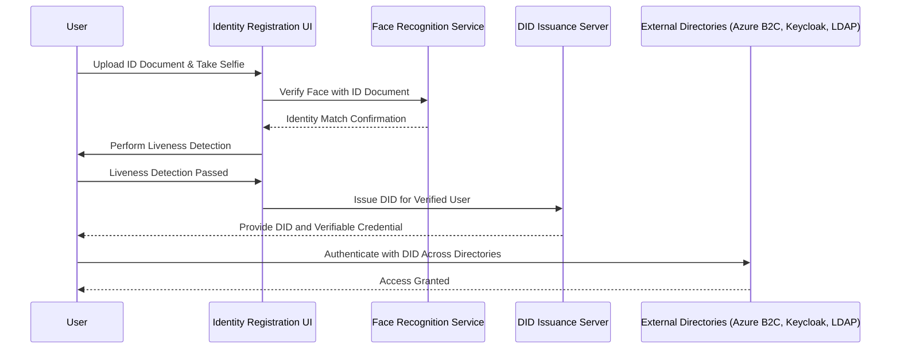

# **📌 Recommended Onboarding Process for Remote DID Registration**

To  **register a user for a DID** , follow these key steps:

1. **User initiates registration on a web/app UI** .
2. **User uploads their government-issued ID** (e.g., driver’s license, passport).
3. **Face recognition library scans user’s face** and  **matches it with the ID** .
4. **User completes liveness detection** to confirm they are a real person.
5. **System verifies identity against external data sources (if needed)** .
6. **Issue a `did:web` (or `did:ion`) DID for the user** .
7. **Store the DID for directory use** (Azure B2C, Keycloak, LDAP, etc.).
8. **Provide the user with a Verifiable Credential (VC)** .

---

## **🛠️ Tech Stack & Components**

To build this system, you need:

| Component                               | Technology                                                                       |
| --------------------------------------- | -------------------------------------------------------------------------------- |
| **Web/App UI**                    | React, Vue.js, or a native mobile app                                            |
| **Face Recognition**              | AWS Rekognition, OpenCV, Microsoft Face API, or OpenAI's Whisper for ID matching |
| **Liveness Detection**            | iBeta-compliant services like iProov or Onfido                                   |
| **Document Verification**         | OCR solutions like Google Vision API, AWS Textract, or IDScan                    |
| **DID Issuance**                  | DIDKit (`did:web`), ION/Sidetree (`did:ion`), or Veramo                      |
| **Identity Provider Integration** | Azure B2C, Keycloak, Entra External ID, OpenAM                                   |

---

## **🔹 Step-by-Step Remote DID Registration Process**

Below is a structured onboarding workflow  **using face recognition and ID verification** .



---

## **🔹 Best Remote Identity Verification Approaches**

To **prevent fraud** and  **ensure trusted DID issuance** , use these industry best practices:

### **1️⃣ ID Document Verification**

* Extract user  **name, date of birth, and ID number** .
* Use **OCR & document validation** services like:
  * ✅ **Google Vision OCR**
  * ✅ **AWS Textract**
  * ✅ **IDScan**

### **2️⃣ Face Recognition & ID Matching**

* Use **biometric face matching** to verify the user’s  **live selfie against their ID** .
* Best APIs:
  * ✅ **AWS Rekognition**
  * ✅ **Microsoft Face API**
  * ✅ **OpenCV (On-Premises)**

### **3️⃣ Liveness Detection**

* Ensure  **the user is not using a static image or deepfake** .
* Best solutions:
  * ✅ **Onfido**
  * ✅ **iProov**
  * ✅ **FaceTec**

### **4️⃣ DID Creation**

* **Best DID method?**
  * ✅ **Use `did:web` for quick issuance** (hosted under the organization's domain).
  * ✅ **Use `did:ion` for long-term decentralized storage** (anchored on Bitcoin).

---

## **🔹 Generating a DID for the User**

After  **face recognition and ID verification** , generate a DID for the user.

### **Step 1: Generate the DID**

```bash
didkit generate-did web https://identity.example.com/users/12345
```

### **Step 2: Create & Store `did.json`**

Save the user’s DID document in:

```
https://identity.example.com/users/12345/did.json
```

Example `did.json`:

```json
{
  "id": "did:web:identity.example.com:users:12345",
  "verificationMethod": [{
      "id": "did:web:identity.example.com:users:12345#key-1",
      "type": "JsonWebKey2020",
      "controller": "did:web:identity.example.com",
      "publicKeyJwk": {
        "kty": "EC",
        "crv": "P-256",
        "x": "public-key-x",
        "y": "public-key-y"
      }
  }],
  "authentication": ["did:web:identity.example.com:users:12345#key-1"]
}
```

---

## **🔹 Issuing a Verifiable Credential**

Once the DID is generated, issue a **Verifiable Credential** (VC) for the user.

```bash
didkit issue-credential \
  --holder did:web:identity.example.com:users:12345 \
  --credential '{
    "@context":["https://www.w3.org/2018/credentials/v1"],
    "type":["VerifiableCredential"],
    "issuer":"did:web:identity.example.com",
    "credentialSubject": {
      "id": "did:web:identity.example.com:users:12345",
      "name": "Alice Doe",
      "documentType": "Passport"
    }
  }' \
  --private-key key.json
```

---

## **🔹 How the DID is Used Across Directories**

Once issued, the **user’s DID can be used across multiple directories** such as  **Azure B2C, Keycloak, OpenAM, Entra External ID, or LDAP** .

| Identity Provider                | Integration Method            |
| -------------------------------- | ----------------------------- |
| **Azure B2C**              | OIDC Custom Identity Provider |
| **Keycloak**               | OIDC Authentication Flow      |
| **OpenAM**                 | SAML Federation               |
| **Entra External ID**      | OIDC Credential Verification  |
| **LDAP (Linux Directory)** | Map DID to `uid`attributes  |

---

## **🚀 Summary: Why This Works Best for Remote Users**

✅  **Users can onboard remotely with face recognition & ID verification** .

✅  **Ensures high security, reducing fraud risks** .

✅ **DID is portable across multiple authentication providers** (OIDC, SAML, LDAP).

✅  **No centralized control – Users own their identities** .

✅  **Enables passwordless authentication via Verifiable Credentials** .

---

## **📖 Full Setup Guide**

For  **detailed implementation steps** :

🔗 **[Read the Full Setup Guide](https://github.com/Cloudstrucc/cs-identity/blob/main/did-web-onboarding.md)**

---

## **🔗 Additional Resources**

* [DIDKit by Spruce ID](https://github.com/spruceid/didkit)
* [Microsoft Entra External ID](https://learn.microsoft.com/en-us/azure/active-directory/external-identities/)
* [Face Recognition API Docs (AWS Rekognition)](https://docs.aws.amazon.com/rekognition/latest/dg/faces.html)
* [iBeta Compliance for Liveness Detection](https://www.ibeta.com/liveness-detection-certification/)

---

## **🔹 Next Steps**

🚀 **Build the UI for user onboarding** (React, Vue, or native app).

🚀 **Integrate face recognition & ID scanning** using OCR/biometric APIs.

🚀 **Automate DID issuance & storage** using DIDKit or Veramo.

🚀 **Connect DID authentication to external identity providers (Azure B2C, Keycloak, OpenAM, etc.).**

---

Let me know if you need **technical code samples** for any specific step! 🚀
