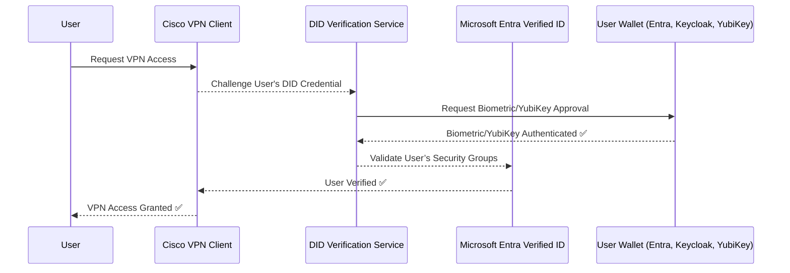

# **🔹 Replacing Entrust CA-Based VPN Authentication with DID-Based Verifiable Credentials**

## **📌 Overview**

Many organizations use  **Entrust CA for VPN authentication** , requiring users to:

1. **Log into their Windows machine** with  **Active Directory (AD) credentials** .
2. **Invoke Cisco VPN** , which triggers an  **Entrust CA challenge** .
3. **Enter a private key password** to authenticate VPN access.

This setup ensures  **strong authentication** , but it relies on **centralized certificate authorities (CAs)** and  **password-based authentication** .

### **✅ Alternative Solution: DID-Based Verifiable Credential Authentication**

Instead of using  **Entrust CA** , the **Cisco VPN client** can be configured to:

1. **Authenticate the user’s DID-based Verifiable Credential (VC)** via  **Entra Verified ID** .
2. **Challenge the user to approve authentication** via:
   * **A wallet app** (Microsoft Authenticator, Keycloak Wallet, etc.).
   * **A hardware security device** (YubiKey, Ledger, TPM).
3. **VPN access is granted** once authentication is approved.

### **🔹 Benefits of This Approach**

✅ **Eliminates passwords** – Users don’t need to enter private key passwords.

✅ **Decentralized Authentication** – No dependency on **centralized CAs** like Entrust.

✅ **Stronger Security** – Uses  **biometric or hardware-based approval** .

✅ **Seamless User Experience** – Users authenticate using  **wallets & hardware keys** .

---

## **1️⃣ How DID-Based Authentication Works for Cisco VPN**

Instead of  **prompting for an Entrust CA private key** , the **Cisco VPN client** will:

1. **Authenticate the user’s DID-based Verifiable Credential** (VC).
2. **Trigger an Entra Verified ID challenge** for approval.
3. **The user approves authentication** via a **wallet (Entra Wallet, Keycloak, etc.)** or  **hardware key (YubiKey, Ledger)** .
4. **VPN access is granted** if the credential is valid.

### **🔹 Authentication Flow**



---

## **2️⃣ Step-by-Step Implementation**

### **🔹 Step 1: Issue a DID-Based Verifiable Credential for VPN Access**

1. **Define the DID-based Verifiable Credential (VC) Schema** .

* This credential will be issued to users when they enroll.
* It will include  **security groups, VPN permissions, and network roles** .

#### **📌 Example: DID-Based VPN Credential**

```json
{
  "id": "did:web:example.com:user123",
  "issuer": "did:web:example.com",
  "credentialSubject": {
    "id": "did:web:example.com:user123",
    "name": "Alice Doe",
    "role": "IT Admin",
    "vpn_access": true,
    "securityGroups": [
      {
        "id": "SG-VPN-Users",
        "entraIDGroupID": "aad-group-987654",
        "permissions": ["vpn_access", "network_access"]
      }
    ]
  },
  "proof": {
    "type": "JsonWebSignature2020",
    "created": "2025-01-28T12:34:56Z",
    "verificationMethod": "did:web:example.com#key-1",
    "proofPurpose": "assertionMethod",
    "jws": "signature-value"
  }
}
```

2. **Issue this credential via Entra Verified ID** .

```http
   POST https://<entra_tenant>.verifiablecredentials.azure.com/v1.0/issue
   Content-Type: application/json

   {
       "subject": {
           "id": "did:web:example.com:user123",
           "claims": {
               "vpn_access": true,
               "securityGroups": ["SG-VPN-Users"]
           }
       },
       "type": ["VerifiableCredential"]
   }
```

---

### **🔹 Step 2: Configure Cisco VPN to Challenge Verifiable Credentials**

Cisco VPN must be configured to:

1. **Integrate with Entra Verified ID** as an  **identity provider** .
2. **Request DID-based credentials** instead of Entrust CA certificates.
3. **Automatically verify the user’s credentials** before granting access.

#### **📌 Cisco VPN Authentication Configuration**

Edit the **Cisco AnyConnect VPN authentication profile** to use  **OIDC authentication with Entra Verified ID** .

```xml
<Authentication>
    <OIDC>
        <ProviderURL>https://login.microsoftonline.com/{tenant_id}/v2.0</ProviderURL>
        <ClientID>vpn-client-app-id</ClientID>
        <RedirectURI>https://vpn.example.com/auth/callback</RedirectURI>
        <Scope>openid profile vpn_access</Scope>
    </OIDC>
</Authentication>
```

---

### **🔹 Step 3: Authenticate with DID-Based Credentials**

1. **User initiates VPN login** .
2. Cisco VPN **redirects them to Entra Verified ID** for authentication.
3. **Entra Verified ID verifies the DID-based credential** .
4. **The user approves authentication** via:
   * ✅ **Biometric scan** (Face ID, Windows Hello, fingerprint).
   * ✅ **Hardware key** (YubiKey, Ledger).
5. **VPN access is granted** once verification is successful.

#### **📌 DID Verification Request**

When the VPN client requests authentication, it verifies the DID:

```http
POST https://<entra_tenant>.verifiablecredentials.azure.com/v1.0/verify
Content-Type: application/json

{
  "credential": "<DID_CREDENTIAL>"
}
```

---

### **🔹 Step 4: Enforcing Conditional Access for VPN with Entra ID**

To further secure VPN access:

* **Enforce Conditional Access Policies in Entra ID** .
* Require **MFA (Biometric or Hardware Key)** before granting VPN access.

#### **📌 Entra ID Conditional Access Policy**

1. Navigate to **Microsoft Entra Admin Center** → **Security** →  **Conditional Access** .
2. Create a new policy:
   * **Assignments → Users and Groups** → Require group  **SG-VPN-Users** .
   * **Conditions → Client Apps** → Require  **DID-based authentication** .
   * **Access Controls → Grant** → Require  **Multi-Factor Authentication (MFA)** .
3. Save & apply the policy.

---

## **3️⃣ How This Solution Improves Security**

| Feature                                        | Entrust CA | DID-Based VC |
| ---------------------------------------------- | ---------- | ------------ |
| **Passwordless Authentication**          | ❌ No      | ✅ Yes       |
| **Decentralized Verification**           | ❌ No      | ✅ Yes       |
| **Biometric or Hardware Authentication** | ❌ No      | ✅ Yes       |
| **Seamless VPN Access**                  | ❌ No      | ✅ Yes       |
| **Conditional Access Enforcement**       | ✅ Yes     | ✅ Yes       |

---

## **4️⃣ Extending the Solution: Device + Network Access**

With  **DID-based authentication** , we can extend this beyond VPN access:

* **Windows/macOS/Linux Login** → Entra ID verifies DID before unlocking the device.
* **Wi-Fi / Network Access** → Network firewall enforces  **DID-based authentication** .
* **Application Authentication** → Apps challenge the **DID credential** before granting access.

---

## **🚀 Conclusion**

✅  **Replaces Entrust CA with DID-based authentication for VPN** .

✅  **Users authenticate with biometrics or YubiKey instead of passwords** .

✅  **Seamless integration with Cisco VPN + Entra Verified ID** .

✅  **Enforces fine-grained security with Entra ID Conditional Access** .

✅  **Future-proof: Extensible to network & application-level authentication** .
