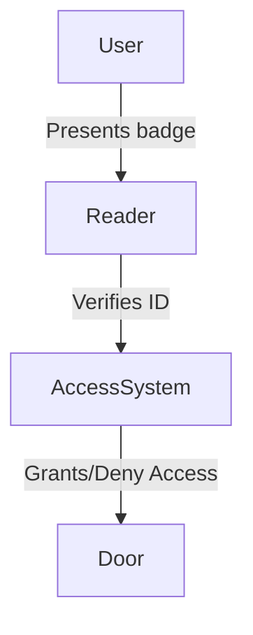
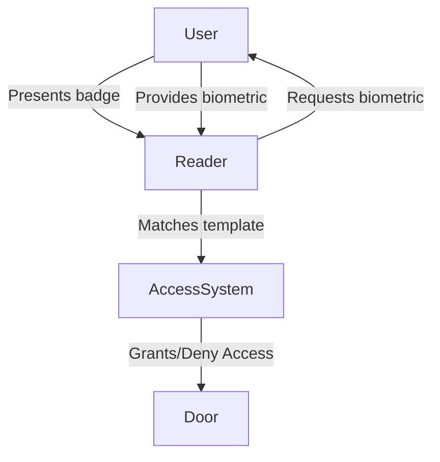
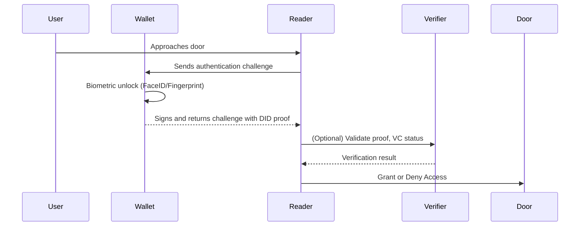
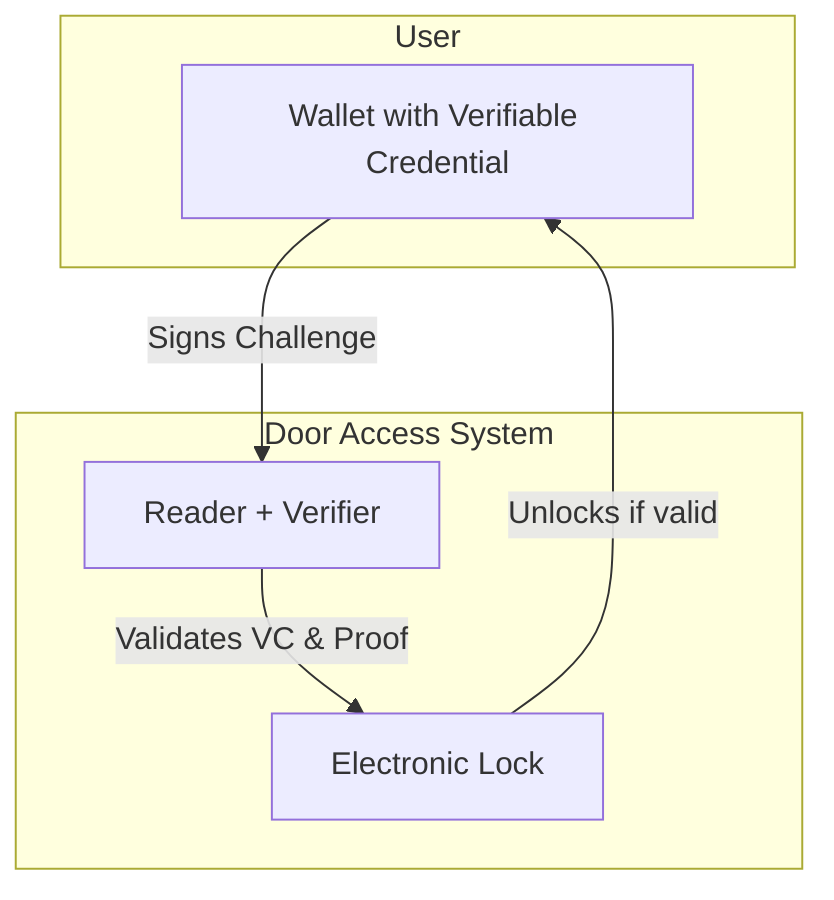

# Decentralized Identity (DID) Based Building Access Control

Modern building access systems have evolved significantly, moving from physical keys to electronic badges that leverage technologies like **NFC**, **RFID**, and **Bluetooth Low Energy (BLE)**. These methods are widely used and include:

1. **NFC (Near Field Communication)**: Used in smartcards and phones, fast and secure within short range.
2. **RFID (Radio Frequency Identification)**: Common in older systems; longer read range than NFC.
3. **Bluetooth Low Energy (BLE)**: Enables proximity-based mobile access using apps or digital ID wallets.
4. **Smartcards / Contactless Cards**: NFC/RFID-based physical credentials used in most offices.
5. **Biometric + Badge Combos**: Combines a physical badge with fingerprint, facial, or iris recognition.

While these systems have improved convenience and security, they still rely on centralized infrastructure and issued devices, which are vulnerable to loss, duplication, or administrative burden. This has led to increasing interest in **Decentralized Identity (DID)** as a more secure, private, and flexible solution.

A **DID** is a cryptographically secure identifier that users fully control, typically stored in a digital wallet. It can carry **Verifiable Credentials (VCs)** issued by trusted organizations (like employers or governments) and used to prove access rights without revealing unnecessary personal data.

This document explores how DID-based systems can enhance or replace traditional access methods by providing:
- Greater privacy
- Improved security
- Seamless cross-org interoperability
- User-owned identity models

---

## 1. Traditional Access Control

### Smartcard / Badge-Based Access

### Biometric + Badge Access

---

## 2. DID-Based Access Control (User Wallet)

### Key Components

- **User Wallet**: Stores Verifiable Credentials (VCs) and signs challenges.
- **Reader/Verifier**: Installed at door, communicates with the wallet via NFC/BLE or QR.
- **Verifier Backend**: Optional, verifies signature or credential status.

### DID Flow Overview

---

## 3. Benefits of DID-based Access

| Feature                  | Traditional Badge | Biometric Combo | DID-Based                 |
| ------------------------ | ----------------- | --------------- | ------------------------- |
| User-Controlled Identity | No                | No              | **Yes**                   |
| MFA with Biometrics      | Optional          | Yes             | **Yes (on-device)**       |
| Remote Revocation        | Hard              | Hard            | **Easy**                  |
| Privacy-Preserving       | No                | No              | **Yes**                   |
| Interoperability         | Low               | Medium          | **High**                  |

---

## 4. State-of-the-Art Features

### 4.1 Verifiable Access Logs

**What it is:**
Create tamper-evident logs that record every access attempt and store it immutably (e.g., in a distributed ledger).

**How it's implemented:**

- Each successful or failed DID proof is cryptographically signed and recorded.
- The log is hashed and anchored to a blockchain (public or consortium) to ensure it hasn’t been altered.
- Administrators can audit access history securely without exposing user identity.

---

### 4.2 Temporary Access Credentials

**What it is:**
Time-limited, purpose-specific Verifiable Credentials that grant access for a defined period or purpose.

**How it's implemented:**

- A credential issuer (e.g., front desk admin) creates a VC valid for a few hours.
- Issued to a visitor’s mobile wallet via QR or deep link.
- Door reader checks expiration and usage policy in the VC.
- VC auto-expires and cannot be reused.

---

### 4.3 Offline Access with Cached Credentials

**What it is:**
Enable doors to open without internet connectivity by using pre-validated or time-bound VCs.

**How it's implemented:**

- Wallet contains a signed VC with embedded policies and expiration time.
- Door reader verifies the signature and timestamp locally.
- If the VC is valid and current, access is granted without cloud verification.

---

### 4.4 Cross-Organization Trust Frameworks

**What it is:**
Enable individuals from one organization to access facilities in another org, using interoperable credentials.

**How it's implemented:**

- Organizations join a trust registry or federation (e.g., using Trust over IP stack).
- Each org sets policies defining which VCs from external issuers they accept.
- Readers are configured to recognize and validate trusted VCs from external wallets.

---

### 4.5 Device-Attestation with Wallet Binding

**What it is:**
Ensure credentials are not only tied to a person, but also to a known secure device.

**How it's implemented:**

- When issuing a VC, the issuer binds it to a specific device key pair (e.g., Apple Secure Enclave or Android Keystore).
- Readers verify that the proof was signed by the correct device along with user identity.
- Prevents VC theft or transfer to unauthorized devices.

---

## 5. Example Use Case: Office Entry

---

## 6. Extended Integration: Computer Login, Digital Signatures & Cost Savings

A DID wallet isn't limited to physical access control. Its utility extends into digital domains, offering a unified identity solution across both physical and digital boundaries.

### 6.1 Device and Workstation Authentication

- Employees can log in to computers or cloud services using a DID-based challenge/response mechanism.
- Wallets can require biometric unlock to initiate login, creating passwordless and phishing-resistant workflows.
- Local login systems (e.g., Windows Hello, macOS login) can integrate DID signature verification modules.

### 6.2 Digital Signatures and Workflow Approvals

- Employees can digitally sign documents or approve tasks using their DID wallet.
- Each signature is cryptographically verifiable and can be logged immutably.
- Replaces legacy PKI certificates and smartcards.

### 6.3 Potential Cost Savings

Implementing a unified DID system can significantly reduce operational and administrative overhead:

| Cost Area                  | Legacy Systems                 | DID-Based Systems              |
|---------------------------|--------------------------------|-------------------------------|
| Badge/Card Issuance       | $$ Per Employee                | Included in digital wallet     |
| Physical Badge Replacement| $25–$100 per incident          | Not applicable                |
| Password Reset Tickets    | Helpdesk hours                 | Eliminated with passwordless  |
| Infrastructure Maintenance| On-prem servers, card printers | Cloud-native, mobile-first    |
| Federation Licensing      | Per-partner identity licenses  | VC/DID interoperability        |

---

## 7. Tech Stack Possibilities

- **DID/VC Frameworks**: [DIF](https://identity.foundation/), [Veramo](https://veramo.io/), [Indy](https://hyperledger-indy.readthedocs.io/)
- **Wallets**: Trinsic, Lissi, Bloom, custom mobile wallets
- **Communication Protocols**: DIDComm, NFC, BLE, QR codes
- **Verifiers**: Cloud verifiers, local edge device validators
- **Anchoring**: Ethereum, Hyperledger, IPFS for logs

---

## 8. Summary

DID-based access control offers a privacy-first, highly secure, and user-owned alternative to traditional access systems. With features like temporary credentials, offline access, and cross-org interoperability, it represents the next evolution in building security and identity verification.

