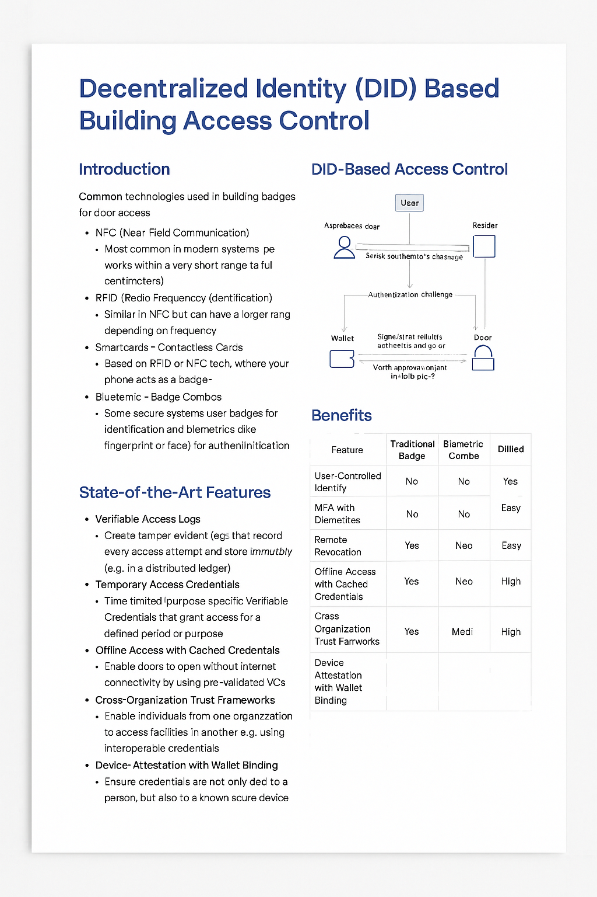

# Whitepaper: Decentralized Identity (DID) for Unified Physical and Digital Access Control

## Executive Summary

This whitepaper introduces a new approach to access control using Decentralized Identity (DID) technology. Traditional badge-based access and identity management systems are limited by centralization, high administrative overhead, and poor interoperability. DID offers a privacy-respecting, user-controlled, cryptographically secure alternative. By replacing physical badges and login passwords with Verifiable Credentials (VCs), organizations can streamline onboarding, reduce costs, and increase security across both physical facilities and digital environments.

---

## Industry Problem

Organizations currently rely on a fragmented patchwork of access systems:

* Physical badges or smartcards for door entry
* Separate credentials for device and system login
* Static passwords vulnerable to phishing and misuse
* High cost and complexity of issuing, revoking, and managing access

These challenges are further exacerbated in hybrid or multi-tenant environments, where traditional federation protocols create friction and security risks.

---

## The Solution: DID-Powered Access Control

A decentralized identity system leverages W3C-standard DIDs and Verifiable Credentials to deliver:

* A **user-controlled mobile wallet** for all access credentials
* Seamless **physical access** via NFC/BLE-enabled door readers
* **Device and cloud authentication** via DID challenge-response
* **Digital signatures** and approvals using issued credentials

This approach enables secure, passwordless workflows and access mechanisms across organizational boundaries.

---

## Core Capabilities

1. **Physical Access with Wallet-as-Badge**
   * Users tap their phone to enter facilities
   * Challenge is signed using DID wallet with biometric unlock
2. **Workstation Login Integration**
   * Devices authenticate users via wallet signature (e.g., Windows Hello extension)
   * Passwordless MFA built-in via device + biometrics
3. **Digital Workflow Signatures**
   * Sign contracts, HR forms, or approvals with DID wallet
   * Integrated with Entra Verified ID or internal VC issuers
4. **Cross-Org Access Interoperability**
   * Accept VCs from partner orgs via trust framework
   * Reduce need for duplicate identity onboarding
5. **Admin Dashboard + Revocation**
   * Credential issuance, tracking, and revocation in real-time
   * Auditable access logs and analytics
6. **Flexible Onboarding Options**
   * Self-service via ID and face match
   * Optional video-supervised KYC for high-assurance roles

---

## Integration with Hardware Keys (e.g., YubiKey)

DID wallets can be extended or anchored to physical devices like  **YubiKeys** ,  **Nitrokeys** , or **SoloKeys** to enhance portability and offline security.

### Benefits:

* **Portable Wallet Option** : Store private keys and verifiable credentials in a secure hardware form factor.
* **Offline Signatures** : Authenticate even when mobile devices or apps are unavailable.
* **Multi-device Portability** : Use on laptops, desktops, or kiosks via USB-C or NFC.

### Integration Model:

* DID wallet software can recognize the hardware key as the credential signer.
* Credentials may be backed up or exported into the YubiKey for challenge signing.
* FIDO2 or WebAuthn capabilities can serve as a second factor or fallback method.

This hybrid model supports organizations with high assurance requirements or mobile-device restrictions, such as government, healthcare, or defense environments.

---

## Implementation Architecture

* **User Wallet:** Mobile app or hardware key storing credentials and signing challenges
* **Door/Device Readers:** BLE/NFC enabled verifiers
* **Verifier Backend:** Cloud service to validate credentials
* **Issuer Registry:** Internal or external VC issuers
* **Admin Console:** Credential management platform for IT/security teams

---

## Business Benefits

| Impact Area    | Benefit                                      |
| -------------- | -------------------------------------------- |
| Cost Reduction | Eliminate physical badge issuance & resets   |
| Security       | Prevent phishing, spoofing, and tailgating   |
| UX             | Passwordless, cross-device access            |
| Compliance     | Verifiable audit logs, revocable credentials |
| Agility        | Easy onboarding/offboarding & policy change  |

---

## Standards & Interoperability

Built on industry standards:

* W3C DID and Verifiable Credentials
* Trust over IP and OpenID for Verifiable Presentations
* Compatible with Microsoft Entra Verified ID, DIF, and Hyperledger Indy
* WebAuthn and FIDO2 hardware key compatibility

---

## Conclusion

DID-based access control redefines how people interact with systems and spaces. It transforms identity from a centralized vulnerability into a distributed, verifiable, and user-first architecture that adapts to the needs of modern organizations.

We invite enterprises, security architects, and technology leaders to explore how DID can unify and simplify their identity infrastructure—across physical and digital domains.
