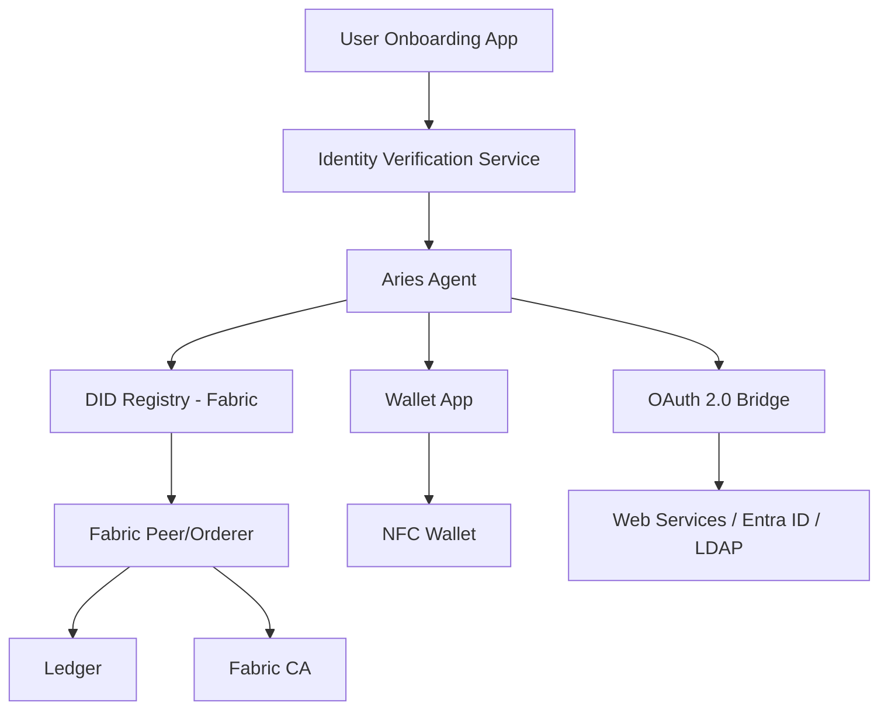
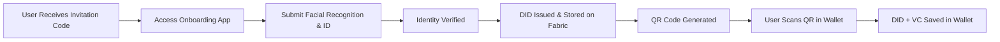
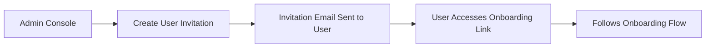
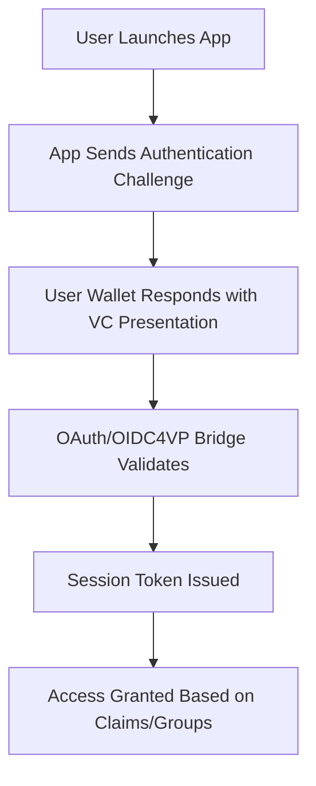

# Decentralized Identity (DID) Onboarding Platform Architecture & Implementation Guide

## 📌 Overview

This document outlines the solution architecture and implementation steps for a **Decentralized Identity (DID) onboarding platform** using **Hyperledger Fabric**, **DIDComm agents**, and **facial recognition with government-issued ID verification**. Once verified, users are issued a DID and a scannable QR/RFID for integration with a wallet app. The system also integrates with enterprise identity providers like **Microsoft Entra ID (Azure AD)** for enhanced identity governance.

This architecture is intended to offer scalable, secure, and user-centric identity management that integrates physical and digital access, bridges traditional IAM (Identity Access Management) infrastructure, and aligns with global decentralized identity standards such as **W3C DID**, **Verifiable Credentials**, and **OIDC4VP**.

---

## 🎯 Objectives

- Provide secure, user-owned decentralized identity
- Enable onboarding via biometric and document verification
- Issue and manage DIDs on a permissioned blockchain
- Integrate DID-authenticated sessions with web services via OAuth
- Enhance security through integration with **LDAP-compatible** identity systems
- Enable unified governance over physical and digital access systems

---

## 🏗️ Architecture Design

### 🔎 Why This Architecture?

- **User-Centric Identity**: The user holds and controls their credentials in a secure wallet, reducing the risk of centralized data breaches.
- **Verifiable Trust**: Identity data is cryptographically signed and anchored to a permissioned ledger, providing non-repudiation.
- **Seamless Enterprise Integration**: The architecture integrates with **Microsoft Entra ID**, **M365**, and **Linux-based LDAP** environments, supporting both federated and local access control.
- **Passwordless Authentication**: Eliminates the attack surface from password reuse, phishing, and brute-force attacks.
- **Secure Physical Access**: Extends identity claims from digital systems to real-world environments like buildings or secure rooms.

---

### 🧱 Component Breakdown

#### 1. Onboarding App (Mobile/Web)

- Facial recognition and liveness check
- Upload government-issued ID (e.g., passport, license)
- Sends data to Identity Verification Service

#### 2. Identity Verification Service

- Validates biometric and document
- Uses 3rd-party services (e.g., **iProov**, **Jumio**, **Onfido**)
- On success, triggers DID issuance process

#### 3. Aries Agent

- Handles DID creation, credential issuance
- Supports **DIDComm** for messaging
- Operates with TrustBloc or custom DID method on Fabric

#### 4. DID Registry (Chaincode)

- Smart contract deployed on **Hyperledger Fabric**
- Stores/verifies DID documents

#### 5. Fabric CA & Network

- Permissioned blockchain nodes
- Issues identities to nodes and agents

#### 6. OAuth 2.0 Bridge

- Connects DID-authenticated sessions with web services
- Issues access tokens post-proof
- Supports OIDC4VP for Verifiable Presentations

#### 7. Wallet App (User Controlled)

- Scans QR/RFID to import DID
- Stores credentials
- Supports selective disclosure

#### 8. NFC-Based Hardware Wallets

- Support for **FIDO2/WebAuthn** keys with secure element
- Stores DIDs or Verifiable Credentials securely
- Enables offline cryptographic operations (e.g., YubiKey, SoloKey)
- NFC integration for contactless authentication and credential retrieval

#### 9. Federated Trust Registries

- Collection of trusted issuers (governments, institutions, etc.)
- Shared trust framework for cross-jurisdictional verification
- Example: Canadian **Pan-Canadian Trust Framework**, **IDunion** in the EU

#### 10. Admin Console

- Monitors onboarding flows
- Audits DID issuance and verifications
- Sends invitation codes to users

### 🌐 Architecture Diagram (Mermaid.js)



### 🧭 User & Admin Journey

#### 👤 User Journey: Onboarding



#### 🛠️ Admin Journey: Invitation Workflow



#### 🔐 Post-Onboarding Authentication Flow



---

## 💻 Implementation Guide

### 1. Aries Agent + Hyperledger Fabric Integration

#### a. Aries Agent Configuration

```bash
# Clone ACA-Py
https://github.com/hyperledger/aries-cloudagent-python.git

# Set up virtual environment
python3 -m venv env
source env/bin/activate
pip install -r requirements.txt

# Start the ACA-Py agent
aca-py start --inbound-transport http 0.0.0.0 8020 \
             --outbound-transport http \
             --admin-insecure-mode \
             --admin 0.0.0.0 8031 \
             --genesis-url <GENESIS_URL> \
             --wallet-type indy \
             --wallet-name <WALLET_NAME> \
             --wallet-key <WALLET_KEY> \
             --auto-provision \
             --log-level INFO
```

#### b. Fabric Chaincode Sample

```go
package main

import (
    "encoding/json"
    "fmt"
    "github.com/hyperledger/fabric-contract-api-go/contractapi"
)

type SmartContract struct {
    contractapi.Contract
}

type DIDDocument struct {
    ID      string `json:"id"`
    Context string `json:"@context"`
}

func (s *SmartContract) CreateDID(ctx contractapi.TransactionContextInterface, did string, doc string) error {
    var didDoc DIDDocument
    err := json.Unmarshal([]byte(doc), &didDoc)
    if err != nil {
        return err
    }
    didDoc.ID = did
    didJSON, err := json.Marshal(didDoc)
    if err != nil {
        return err
    }
    return ctx.GetStub().PutState(did, didJSON)
}

func (s *SmartContract) ReadDID(ctx contractapi.TransactionContextInterface, did string) (*DIDDocument, error) {
    didJSON, err := ctx.GetStub().GetState(did)
    if err != nil {
        return nil, err
    }
    if didJSON == nil {
        return nil, fmt.Errorf("DID %s does not exist", did)
    }
    var didDoc DIDDocument
    err = json.Unmarshal(didJSON, &didDoc)
    if err != nil {
        return err, nil
    }
    return &didDoc, nil
}
```

### 2. Node.js QR Code Integration

#### a. Generate QR Code

```bash
npm install qrcode
```

```javascript
const QRCode = require('qrcode');

async function generateQRCode(did) {
    try {
        const qrCodeDataURL = await QRCode.toDataURL(did);
        return qrCodeDataURL;
    } catch (err) {
        console.error('Error generating QR code', err);
        throw err;
    }
}

const userDID = 'did:example:123456789abcdefghi';
generateQRCode(userDID).then(console.log);
```

#### b. Display in Express App

```javascript
app.get('/show-qr', (req, res) => {
    const userDID = 'did:example:123456789abcdefghi';
    generateQRCode(userDID).then(qrCodeDataURL => {
        res.render('show-qr', { qrCodeDataURL });
    }).catch(err => {
        res.status(500).send('Error generating QR Code');
    });
});
```

#### c. EJS Template

```html
<h1>Scan this QR Code to add your DID to your wallet</h1>
" alt="DID QR Code">
```

---

## 🔁 Future Extensions

### ✅ Verifiable Presentations for Login

- Users present VCs from wallet
- OAuth Bridge verifies VP
- Enables passwordless login with **OIDC4VP**

### ✅ Federated Trust Registries

- Shared governance model for trust issuers
- Cross-jurisdictional DID verification

### ✅ Support for Web5 / DIDs on Bitcoin

- Leverage `did:ion` or `did:btc`
- Fully decentralized via Sidetree
- Complements Fabric-based identity systems

---

## 📘 References

- [W3C DID Spec](https://www.w3.org/TR/did-core/)
- [W3C Verifiable Credentials](https://www.w3.org/TR/vc-data-model/)
- [DIDComm Messaging Spec](https://identity.foundation/didcomm-messaging/spec/)
- [Web5](https://web5.xyz/)
- [OIDC4VP](https://openid.net/specs/openid-4-verifiable-presentations-1_0.html)
