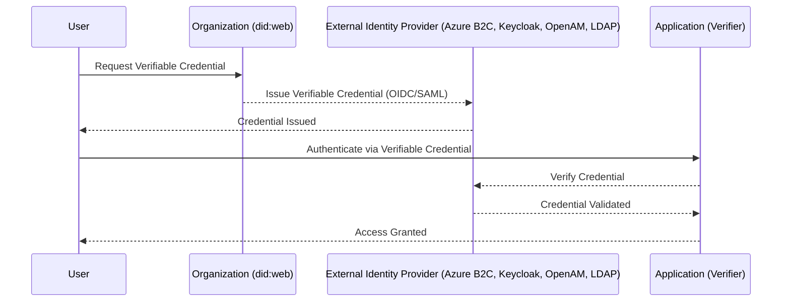

# **🚀 Decentralized Identity (`did:web`) Integration with Multiple Identity Providers**

## **📌 Overview**

Organizations today need **secure, decentralized, and user-controlled identity solutions** to enhance  **privacy, security, and interoperability** . This repository provides a **step-by-step guide** to integrating **DID:web (Decentralized Identifiers using a web domain)** with  **various identity providers** , enabling organizations to  **issue and verify Verifiable Credentials (VCs) securely** .

### **✅ Key Features in This Repository**

🔹 **Integration guides for multiple Identity Providers** – Including  **Microsoft Entra Verified ID, OpenAM, Azure B2C, and Keycloak** .

🔹 **Onboarding App** – A **Node.js app** featuring  **facial recognition, ID verification, liveness detection, and DID issuance** .

🔹 **Deployment Guides** – Instructions for  **Azure (App Service, Entra External ID) and AWS (Elastic Beanstalk, Lightsail, Keycloak)** .

🔹 **Access Controls for Networks & Devices** – **Authenticate users across devices, VPN, and network security layers** using DIDs.

🔹 **Authentication with OIDC, SAML, and LDAP** – Use **DID-based authentication** without refactoring all existing apps.

**📌 These guides are intended for testing and integration purposes, not for production deployment.**

---

# **📂 Project Contents**

## **1️⃣ Identity Provider Integration Guides**

🔗 **[Entra Verified ID &amp; DID:web (For Internal Users)](https://github.com/Cloudstrucc/cs-identity/blob/main/did-vid.md)**

🔗 **[DID:web with External Identity Providers (Keycloak, OpenAM, Azure B2C, LDAP)](https://github.com/Cloudstrucc/cs-identity/blob/main/did-web-external-idp.md)**

## **2️⃣ Onboarding App for Identity Verification**

🔗 **[Node.js Onboarding App (Facial Recognition, ID Verification, and Verifiable Credential Issuance)](https://github.com/Cloudstrucc/cs-identity/blob/main/deploy-did-onboardapp.md)**

🖼 **Visual Example:**

*(User aligns their face ➝ Uploads ID ➝ AI verifies identity ➝ DID Issued ✅)*

## **3️⃣ Deployment Guides**

🔗 **[Deploy the Onboarding App to Azure &amp; AWS](https://github.com/Cloudstrucc/cs-identity/blob/main/deploy-did-onboardapp.md)**

## **4️⃣ Access Controls for Device, Network, and App Layer**

🔗 **[Access Control Scenarios](https://github.com/Cloudstrucc/cs-identity/blob/main/did-accesscontrol.md)**

## **5️⃣ Leverage Verifiable Credentials Instead of Entrust CA for VPN & Security**

🔗 **[DID-Based Authentication with Cisco VPN (Replacing Entrust CA)](https://github.com/Cloudstrucc/cs-identity/blob/main/migrationfromentrust-to-did-vid.md)**

---

# **💡 What is a Decentralized Identifier (DID)?**

A **Decentralized Identifier (DID)** is a **globally unique identifier** that allows **individuals, organizations, and devices** to authenticate  **without relying on a centralized authority** . Unlike traditional identity solutions that depend on  **centralized directories** , **DIDs enable self-sovereign identity (SSI)** where  **users own and control their identity** .

## **DID Methods**

| DID Method             | Description                                                          |
| ---------------------- | -------------------------------------------------------------------- |
| **`did:ion`**  | Uses**Sidetree over Bitcoin**for **tamper-proof DIDs** . |
| **`did:key`**  | Ephemeral DIDs that are**generated on-the-fly** .              |
| **`did:ethr`** | Ethereum-based**decentralized identity** .                     |
| **`did:web`**  | DIDs hosted on**an organization’s domain** .                  |

**DID:web is the simplest and most enterprise-friendly approach** because it:
✅ Requires  **no blockchain infrastructure** .

✅ Allows  **organizations to control their own DIDs** .

✅ Works with  **existing web standards** .

---

# **🌍 Why Use `did:web`?**

`did:web` is a **lightweight DID method** that allows organizations to create and host **DIDs on their own domain** (`.well-known/did.json`).

## **🔹 Key Benefits of `did:web`**

✅ **No Blockchain Required** – Unlike `did:ion`, `did:web` does not depend on a blockchain, making it  **cheaper and easier to deploy** .

✅ **Enterprise-Ready** – Organizations can **control their own DID infrastructure** using their domain name.

✅ **Interoperability** – Works with  **Microsoft Entra Verified ID, Azure B2C, Keycloak, OpenAM, and LDAP authentication** .

✅ **Trust & Transparency** – Users can verify credentials  **directly from an organization's website** .

✅ **Fast & Scalable** – No need for  **complex cryptographic anchoring on a blockchain** , making `did:web` a  **scalable solution** .

---

# **🔐 How This Integration Works**

By integrating  **`did:web` with multiple identity providers** , organizations can:
🔹 **Issue verifiable credentials** for employees, customers, and partners.

🔹 **Allow users to authenticate** using their credentials  **without passwords** .

🔹 **Enhance security and privacy** while remaining compliant with  **decentralized identity standards** .

### **🔹 Authentication & Verification Flow**

---

# **🏛️ Use Cases for `did:web` with Identity Providers**

🚀 **Enterprise Identity & Access Management (IAM)** – Employees and customers use  **Verifiable Credentials instead of passwords** .

📜 **Regulatory Compliance & KYC (Know Your Customer)** – Governments and banks can verify customers **without storing sensitive data** centrally.

🛂 **Borderless Digital Identity** – Universities, travel agencies, and healthcare providers issue credentials that  **work across different platforms** .

🔐 **Passwordless Authentication** – Employees and external users log in using their  **verifiable credentials instead of passwords** , reducing phishing risks.

---

# **📖 How to Set Up**

To integrate **DID:web** with  **Entra Verified ID, Azure B2C, Keycloak, OpenAM, or LDAP** , follow these guides:

### **🛠️ Identity Provider Setup**

🔹 **[Microsoft Entra Verified ID](https://github.com/Cloudstrucc/cs-identity/blob/main/did-vid.md)**

🔹 **[Azure B2C](https://github.com/Cloudstrucc/cs-identity/blob/main/did-web-external-idp.md)**

🔹 **[Keycloak](https://github.com/Cloudstrucc/cs-identity/blob/main/did-web-external-idp.md)**

🔹 **[OpenAM (ForgeRock)](https://github.com/Cloudstrucc/cs-identity/blob/main/did-web-external-idp.md)**

🔹 **[Linux LDAP](https://github.com/Cloudstrucc/cs-identity/blob/main/did-web-external-idp.md)**

---

# **🚀 Conclusion**

✅ **User-Controlled Identities** – Eliminates reliance on centralized identity providers.

✅ **Privacy-First** – Reduces data collection while ensuring  **secure and verifiable credentials** .

✅ **Enterprise-Ready** – Organizations can issue and verify credentials  **at scale** .

✅ **DID-Based Authentication at All Levels** – From  **VPN, Network Security, Device Login, and Applications** .

🔗 **[Get Started Here](https://github.com/Cloudstrucc/cs-identity/blob/main/did-vid.md)** 🚀
