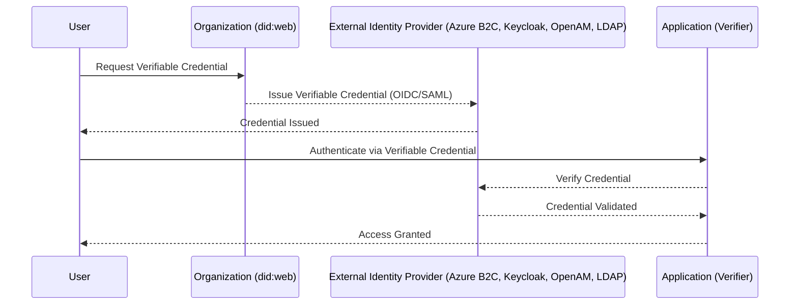

# **Decentralized Identity (`did:web`) Integration with Multiple Identity Providers**

## **📌 Overview**

Organizations today need **secure, decentralized, and user-controlled identity solutions** to enhance  **privacy, security, and interoperability** . This repository provides a **step-by-step guide** to integrating **DID:web** (Decentralized Identifiers using a web domain) with  **various identity providers** , enabling organizations to  **issue and verify Verifiable Credentials (VCs) securely** .

 **This repository includes** :
✅ **Integration guides for multiple Identity Providers** – including **Microsoft Entra Verified ID, OpenAM, Azure B2C, and Keycloak**

✅ **A Node.js onboarding app** – featuring **facial recognition, ID verification, liveness detection, and DID issuance**

✅ **Deployment guides** – for hosting on **Azure (App Service, Entra External ID) and AWS (Elastic Beanstalk, Lightsail, Keycloak)**

✅ **Authentication & DID-based login** – allowing users to authenticate using **OIDC, SAML, and LDAP providers**

**These guides are intended for testing and integration purposes, not for production deployment.**

---

## **📂 Project Contents**

# 1️⃣ **Identity Provider Integration Guides**

🔗 **[Setup Guide (Entra Verified ID & DID:web - Targeted for Internal Users)](https://github.com/Cloudstrucc/cs-identity/blob/main/did-vid.md)**

🔗 **[Setup Guide (DID:web with External Identity Providers - Keycloak, OpenAM, Azure B2C, LDAP)](https://github.com/Cloudstrucc/cs-identity/blob/main/did-web-external-idp.md)**

## 2️⃣ **Onboarding App for Identity Verification**

🔗 **[Node.js Onboarding App (Facial Recognition, ID Verification, and Verifiable Credential Issuance)](https://github.com/Cloudstrucc/cs-identity/blob/main/deploy-did-onboardapp.md)**

### 3️⃣ **Deployment Guides**

🔗 **[Deploy the Onboarding App to Azure & AWS](https://github.com/Cloudstrucc/cs-identity/blob/main/deploy-did-onboardapp.md)**

#### 4️⃣ **Access Controls for Device, Network, and App Layer**

🔗 **[Access Control Scenarios](https://github.com/Cloudstrucc/cs-identity/blob/main/did-accesscontrol.md)**

##### 5️⃣ **Leverage Verifiable Credentials Instead of Entrust CA for Strong Security and Better User Experience**

🔗 **[DID Based Authentication with Cisco VPN](https://github.com/Cloudstrucc/cs-identity/blob/main/migrationfromentrust-to-did-vid.md)**

---

## **💡 What is a Decentralized Identifier (DID)?**

A **Decentralized Identifier (DID)** is a globally unique identifier that allows individuals, organizations, and devices to authenticate  **without relying on a centralized authority** . Unlike traditional identity solutions that depend on  **centralized directories** , **DIDs enable self-sovereign identity (SSI)** where the  **user owns and controls their identity** .

### **DID Methods**

There are multiple ways to create a  **DID** , such as:

* **`did:ion`** (Uses Sidetree over Bitcoin for tamper-proof DIDs)
* **`did:key`** (Ephemeral DIDs generated on-the-fly)
* **`did:ethr`** (Ethereum-based decentralized identity)
* **`did:web`** (DIDs hosted on an organization’s domain)

Among these,  **DID:web is the simplest and most enterprise-friendly approach** .

---

## **🌍 Why Use `did:web`?**

`did:web` is a **lightweight DID method** that allows organizations to create and host DIDs on their **own domain** (`.well-known/did.json`).

### **🔹 Key Benefits of `did:web`**

✅ **No Blockchain Required** – Unlike `did:ion`, `did:web` does not depend on a blockchain, making it  **cheaper and easier to deploy** .

✅ **Enterprise-Ready** – Organizations can **control their own DID infrastructure** using their domain name.

✅ **Interoperability** – Works with  **Microsoft Entra Verified ID, Azure B2C, Keycloak, OpenAM** , and  **LDAP-based authentication** .

✅ **Trust & Transparency** – Users can verify credentials  **directly from an organization's website** .

✅ **Fast & Scalable** – No need for  **complex cryptographic anchoring on a blockchain** , making `did:web` a scalable solution.

---

## **🔐 How This Integration Works**

By integrating  **`did:web` with multiple identity providers** , organizations can:

* **Issue verifiable credentials** for employees, customers, and partners.
* **Allow users to authenticate** using their credentials  **without passwords** .
* **Enhance security and privacy** while remaining compliant with  **decentralized identity standards** .

---

## **⚙️ Authentication & Verification Flow**

The following diagram represents the  **authentication flow using `did:web` with various identity providers** .

---

## **🏛️ Use Cases for `did:web` with Identity Providers**

🚀 **Enterprise Identity & Access Management (IAM)** – Employees and customers use  **Verifiable Credentials instead of passwords** .

📜 **Regulatory Compliance & KYC (Know Your Customer)** – Governments and banks can verify customers **without storing sensitive data** centrally.

🛂 **Borderless Digital Identity** – Universities, travel agencies, and healthcare providers issue credentials that  **work across different platforms** .

🔐 **Passwordless Authentication** – Employees and external users log in using their  **verifiable credentials instead of passwords** , reducing phishing risks.

---

## **📖 How to Set Up**

To integrate **DID:web** with  **Entra Verified ID, Azure B2C, Keycloak, OpenAM, or LDAP** , follow these guides:

### **🛠️ Identity Provider Setup**

* **Microsoft Entra Verified ID** : 🔗 **[Guide](https://github.com/Cloudstrucc/cs-identity/blob/main/did-vid.md)**
* **Azure B2C** : 🔗 **[Guide](https://github.com/Cloudstrucc/cs-identity/blob/main/did-web-external-idp.md)**
* **Keycloak** : 🔗 **[Guide](https://github.com/Cloudstrucc/cs-identity/blob/main/did-web-external-idp.md)**
* **OpenAM (ForgeRock)** : 🔗 **[Guide](https://github.com/Cloudstrucc/cs-identity/blob/main/did-web-external-idp.md)**
* **Linux LDAP** : 🔗 **[Guide](https://github.com/Cloudstrucc/cs-identity/blob/main/did-web-external-idp.md)**

### **🚀 Deploying the Onboarding App**

* **Azure (App Service, Entra External ID)** : 🔗 **[Deployment Guide](https://github.com/Cloudstrucc/cs-identity/blob/main/deploy-did-onboardapp.md)**
* **AWS (Elastic Beanstalk, Lightsail, Keycloak)** : 🔗 **[Deployment Guide](https://github.com/Cloudstrucc/cs-identity/blob/main/deploy-did-onboardapp.md)**

---

## **💡 Why This Matters**

✅ **User-Controlled Identities** – Eliminates reliance on centralized identity providers (Google, Facebook, etc.).

✅ **Privacy-First** – Reduces data collection while ensuring  **secure and verifiable credentials** .

✅ **Enterprise-Ready** – Organizations can issue and verify credentials  **at scale** .

✅ **Interoperable with W3C Standards** – Ensures compatibility across different identity providers.

---

## **🔗 Additional Resources**

* [Microsoft Entra Verified ID](https://learn.microsoft.com/en-us/azure/active-directory/verifiable-credentials/)
* [DID Web Specification (W3C)](https://w3c-ccg.github.io/did-method-web/)
* [DIDKit by Spruce ID](https://github.com/spruceid/didkit)

---

## **📌 Conclusion**

By integrating  **DID:web with multiple identity providers** , organizations can  **leverage decentralized identity solutions for authentication, access management, and verifiable credential issuance** . This approach  **improves security, enhances user privacy, and simplifies digital identity management** .

🔗 **[Get Started Here](https://github.com/Cloudstrucc/cs-identity/blob/main/did-vid.md)** 🚀
